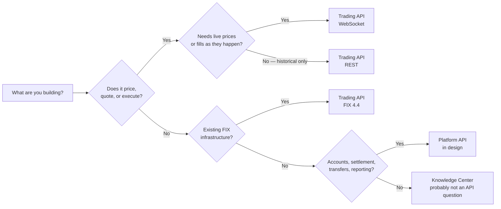

Trillion Digital exposes two APIs. They are not alternatives — most integrations
eventually use both, for different jobs.

<CardGroup cols={2}>
  <Card title="Trading API" icon="bolt" href="/trading-api/overview">
    **Price, quote, execute.**

    Everything that happens *at* the moment of a trade: streaming market data,
    request-for-quote, order entry, execution reports, and live balances.

    Available today.
  </Card>
  <Card title="Platform API" icon="building-columns" href="/platform-api/overview">
    **Everything around the trade.**

    Account administration and money movement: settlement instructions, wallet
    whitelisting, transfers, statements, and reporting.

    In design.
  </Card>
</CardGroup>

## Pick one

## The dividing line

A trade is agreed in seconds and settles over hours or days. The Trading API
covers the seconds. The Platform API covers everything before and after.

| You want to… | API | Why |
| --- | --- | --- |
| Stream live prices | Trading | Push-based market data |
| Request a quote and accept it | Trading | RFQ lifecycle |
| Submit, amend, or cancel an order | Trading | Order entry |
| See fills as they happen | Trading | Execution reports |
| Check your live tradeable balance | Trading | Pre-trade risk needs the current number |
| Register a bank account for settlement | Platform | Account administration |
| Whitelist a wallet address | Platform | Account administration |
| Instruct or track a transfer | Platform | Money movement |
| Pull a month of trades for accounting | Platform | Reporting, not execution |
| Fetch statements | Platform | Reporting |
| Check onboarding or compliance status | Platform | Account state |
| Manage users and API keys | Platform | Account administration |

<Note>
Balances appear on both, deliberately. The Trading API streams the live figure
you size an order against; the Platform API returns point-in-time balances suited
to reconciliation and reporting. Use the first to decide, the second to account.
</Note>

## Why they are built differently

The two APIs have genuinely different shapes, and it is worth understanding why
before you design around either.

<AccordionGroup>
  <Accordion title="Trading API — WebSocket-first, HMAC-signed">
    Execution needs push, not poll: you cannot poll a price you are about to
    trade on. So market data, RFQ, order entry and fills all run over one
    persistent WebSocket connection, and every request is individually
    HMAC-signed for replay protection.

    The cost is implementation effort — signing, connection lifecycle,
    resubscription — which is justified for order flow and not much else.
  </Accordion>
  <Accordion title="Platform API — REST, bearer-authenticated">
    Registering a bank account or exporting last month's trades is ordinary
    request/response work. Making it a plain REST API with a bearer token means
    it works with `curl`, a generated client, or a Postman collection with no
    signing code at all.

    It also gets idempotency keys, cursor pagination, and dated versioning —
    the things a reconciliation job needs and a streaming API cannot easily
    offer.
  </Accordion>
</AccordionGroup>

<Warning>
The two APIs use **different authentication schemes and different credentials**.
A Trading API key is not a Platform API key. Do not build a shared auth layer
that assumes one mechanism covers both — see
[Trading API authentication](/trading-api/authentication) and
[Platform API authentication](/platform-api/authentication).
</Warning>

## Which protocol within the Trading API?

If you have settled on the Trading API, there is a second choice:

| Protocol | Use it when |
| --- | --- |
| [WebSocket](/trading-api/websocket/overview) | Default. Carries the full surface — market data, RFQ, orders, balances, transfers. |
| [REST](/trading-api/rest/overview) | Historical bars and reference data at startup. A small slice. |
| [FIX 4.4](/trading-api/fix/overview) | You already run FIX infrastructure — an OMS or EMS that speaks it natively. |

<Tip>
Building new and unsure? Start with the WebSocket API and the
[Quickstart](/trading-api/quickstart). FIX only pays for itself when you have
existing FIX plumbing to plug into; from a standing start it is more work for
less coverage.
</Tip>

## Today versus soon

<Warning>
The Platform API is **in design and not yet callable.** Its contract is published
so you can review and comment on it before it is built.

Until it ships, the Trading API is the only live API — and it does cover trade
and balance history, which is enough for most reconciliation. See
[REST endpoints](/trading-api/rest/endpoints).
</Warning>

Feedback on the Platform API contract goes to
[support@trilliondigital.io](mailto:support@trilliondigital.io). Changes are far
cheaper now than after implementation.
