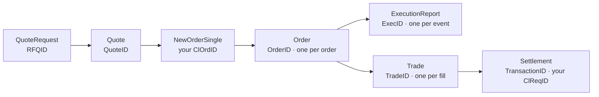

<Note>
Terms describing rails, networks, currencies, and instruments describe **what the
platform supports**, not what is enabled on your account. Availability follows
from your facing [entity](/guides/accounts/entities), its banking partners, and
your commercial terms. Your onboarding documentation and your account manager are
authoritative on what you can actually use.
</Note>

## All-in price

A price that already includes fees. `TradedPx` on the
[`Quote`](/trading-api/websocket/streams/quote) stream is all-in; `AvgPx` on an
[`ExecutionReport`](/trading-api/websocket/streams/order) is not. Comparing an
executed RFQ against a benchmark on `AvgPx` understates what the trade cost you,
because the fee sits outside that number.

## AllowedSlippage

Absolute allowed price movement on a Limit order placed against an RFQ, expressed
as a decimal — `0.001` is 10 bps, not 0.1%. Set on
[`NewOrderSingle`](/trading-api/websocket/commands#neworldersingle).

## AmountCurrency

The currency `Amount` is expressed in, and the third of three currency fields on a
trade. `Currency` says what the quantity is in, `AmountCurrency` what the value is
in, and `FeeCurency` what the fee is in — none of the three is guaranteed to match
the others. Reconciling on the wrong one silently mixes units. See
[Pricing and fees](/guides/trading/pricing-and-fees).

## Available balance

`AvailableAmount` on the [`Balance`](/trading-api/websocket/streams/balance)
stream: your total balance less funds committed to working orders and pending
withdrawals. Size orders and withdrawals against this rather than `Amount`, or
you will be refused for insufficient funds while the account visibly holds
enough.

## AvgPx

Average fill price on the order streams, meaningful only when `CumQty > 0`, and
**excluding fees**. To get the economic price of a fill, take `Fee` and `Amount`
from the [`Trade`](/trading-api/websocket/streams/trade) record.

## Banking calendar

The set of days a rail actually settles on. The calendar that governs is the
**receiving** jurisdiction's, not yours, which is why a payment can sit over a
holiday you do not observe. See
[Operating hours](/guides/operating-hours).

## Base currency

The first leg of a `BASE-QUOTE` symbol — the asset being priced. Buying `BTC-USD`
means receiving BTC and paying USD. See
[Instruments](/guides/trading/instruments).

## Beneficiary

The party being paid, and the name that must match the account record at the
receiving bank exactly. Trading names and abbreviations that differ from the
registered legal name are a routine cause of returned payments. See
[Bank account whitelisting](/guides/settlement/bank-accounts).

## Blotter

The single record of your trades. Voice, chat, portal, and API executions land in
it with the same `TradeID` and the same fields; there is no per-channel ledger
that could drift from another. See
[One ledger](/guides/trading/execution-channels#one-ledger-updated-in-real-time).

## Book transfer

A move between accounts belonging to **the same holder** at one institution.
Distinct from an internal settlement network, which pays a *different* customer
of that institution — and institutions enforce the distinction, so an internal
rail transfer addressed to your own account is refused rather than reinterpreted.
See [Fiat settlement](/guides/settlement/fiat).

## Cancel on Disconnect

FIX tag `20030`, defaulting to `Y`. Orders submitted on a FIX session are cancelled
when that session drops — but **only that session's orders**. Orders placed through
the portal, the WebSocket API, or a second FIX session are untouched. See
[FIX overview](/trading-api/fix/overview#cancel-on-disconnect).

## ClOrdID

Your identifier for a **request**, not for the order. It must be unique daily and
across any open order, and every cancel or replace carries a fresh one that
references the previous request as `OrigClOrdID`. A `DuplicateOrder` or
`DuplicateClOrdID` rejection means the platform already has that request —
resubmitting the same ID will keep failing; query
[`Order`](/trading-api/websocket/streams/order) filtered by it instead.

## ClReqID

The transfer equivalent of `ClOrdID`: your identifier on a withdraw or deposit
request. The platform's own identifier for the resulting movement is
`TransactionID`, which is what appears on
[`BalanceTransaction`](/trading-api/websocket/streams/balance).

## Confirmations

The number of blocks a crypto transfer must be buried under before it is
credited. The threshold is set per asset **and** per network rather than
globally, because chains offer different settlement assurance per block — which
is why the same nominal value credits in minutes on one network and takes longer
on another. See [Crypto settlement](/guides/settlement/crypto).

## CumQty and CumAmt

Cumulative filled quantity and cumulative filled amount. `CumQty` is always in
`Currency` units and `CumAmt` always in `AmountCurrency` — on a `BTC-USD` order,
BTC and USD respectively, regardless of which of the two you expressed the order
in.

## Cut-off

The daily deadline for a rail, after which an instruction is processed on the
next business day. Cut-offs differ by rail, currency, and jurisdiction, and
business days follow the relevant banking calendar — the ones applicable to your
account are in your onboarding documentation, and a missed Friday cut-off
commonly means Monday. See [Operating hours](/guides/operating-hours).

## Dealt currency

The currency your size is expressed in. The platform carries it as `Currency` on
the request: `Currency: BTC, OrderQty: 0.75` means 0.75 BTC, while
`Currency: USD, OrderQty: 50000` means fifty thousand dollars' worth. It also
decides which size increment your order is validated against.

<Warning>
Both forms are valid, and nothing in the response tells you that you meant the
other one. An automated RFQ that relies on a default rather than setting
`Currency` explicitly eventually sends an order two orders of magnitude away from
its intent and gets a firm price on it. See
[RFQ workflow](/guides/trading/rfq-workflow#specifying-size).
</Warning>

## Drop copy

A FIX session receives execution reports for orders it did not submit, including
those placed through the portal or other protocols. Your engine will see `ClOrdID`
values it never issued; treating an unknown identifier as an error is a mistake.
See [FIX overview](/trading-api/fix/overview#drop-copy).

## Entity

The regulated Trillion Digital company that faces you as counterparty, assigned
at onboarding. It determines which currencies, rails, and instruments are
available, which banking partners hold your funds, and which name appears on your
confirmations. Two entities are two separate accounts: separate credentials,
separate settlement registrations, and balances that do not net. See
[Entities](/guides/accounts/entities).

## EquivalentCurrency

A subscription parameter on [`Balance`](/trading-api/websocket/streams/balance) and
[`CurrencyConversion`](/trading-api/websocket/streams/currency#currencyconversion)
that returns converted amounts alongside the native ones. Server-side conversion at
the same instant as the balance, which is why it is preferable to converting
yourself from a separate rate stream.

## ExecID

The server's identifier for a single execution report — one event in an order's
life, not the order and not the trade. Useful for deduplicating a replayed
stream; useless as a reconciliation key.

## ExecType

What just happened to an order — `Trade`, `Canceled`, `PendingCancel`,
`Replaced`, and so on. `OrdStatus` tells you where the order now stands. Read
`ExecType` for the event and `OrdStatus` for the state; driving a state machine
from `ExecType` is how systems conclude an order is dead while it is still
working.

## Exposure

Credit utilisation against `ExposureLimit`, expressed in `ExposureCurrency` —
which is not necessarily the currency of the order you are about to send, so
convert before comparing. Exposure is not balance: an account can hold a healthy
`AvailableAmount` and still be rejected with `OrderExceedsLimit`, because the
binding constraint is the credit line rather than the cash. See
[Credit and exposure](/trading-api/websocket/streams/credit).

## Firm quote

A price executable in the stated size until `ValidUntilTime`, during which it
will not move against you. Quotes expire by default after roughly three minutes,
but the quote's own `ValidUntilTime` is authoritative, and an expired quote
cannot be accepted — you request a new one at the new market.

## Half-open connection

A TCP connection that is dead but never fires a close event, so automatic reconnect
logic never triggers. The socket looks alive and no data flows. Only your own
traffic timeout detects it. See
[Connection lifecycle](/trading-api/connection-lifecycle).

## Idempotency key

A client-supplied header on Platform API writes that makes a retry safe: the same key
replays the original response rather than repeating the action. Derive it from
something stable in your own system and persist it **before** the request — a key
generated at call time is regenerated on retry and defeats the mechanism. See
[Idempotency](/platform-api/idempotency).

## Increment

The granularity an instrument accepts: `MinSizeIncrement` for quantities in the
base currency, `MinAmtIncrement` for quantities in the quote currency, and
`MinPriceIncrement` for prices. Which size increment applies depends on the
currency you expressed the order in, so the same economic order can be valid one
way and rejected the other. Round toward zero — rounding up can push the order
past the headroom you just checked and convert an increment problem into an
`OrderExceedsLimit`. See [Instruments](/guides/trading/instruments).

## Initial

A flag on a stream message marking the snapshot that opens a subscription. Messages
after it are **deltas** on `Security` and `Currency`, not fresh copies — a client
that replaces its local map on each message rather than merging silently empties its
own security master.

## Intermediary bank

A correspondent bank in the path of an international payment. Where the receiving
bank requires one and it is absent, the payment fails in transit rather than being
rejected up front. See [Fiat settlement](/guides/settlement/fiat).

## Internal settlement network

A payment that moves across one institution's own ledger because both sides bank
there, rather than through Fedwire or SWIFT. Each network addresses the
beneficiary its own way — a rail address, a partner UUID, an email — and **not**
by routing and account number. Most are USD; Bitso settles MXN, so the network
partly follows the currency rather than only the beneficiary's bank. Availability
depends on which institutions your entity and your beneficiary bank with; see
[Fiat settlement](/guides/settlement/fiat).

## LeavesQty

Quantity still open for execution, normally `OrderQty − CumQty`. It is also `0`
on a `Canceled` or `Rejected` order, so `LeavesQty == 0` on its own does not mean
filled — check `OrdStatus` before releasing anything downstream.

## MarketAccount

The account within your relationship that a transfer or balance transaction
applies to; the API examples use `default`. It is not the same thing as an
[entity](/guides/accounts/entities) — separate entities are separate accounts
with separate credentials entirely. Ask your account manager which market
accounts exist on your relationship before hardcoding one.

## Memo and destination tag

An extra field some networks require alongside the address to identify the
beneficiary at the receiving institution. Where one is required and omitted,
funds can be credited to the wrong account and be difficult or impossible to
recover — register the memo or tag with the address so it is applied
automatically. Which networks the platform models this way is listed under
[Memo and destination-tag networks](/guides/trading/assets-and-networks#memo-and-destination-tag-networks);
see also [Crypto settlement](/guides/settlement/crypto).

## Minor units

How the Platform API encodes money: an integer string plus an exponent, so
`"125050"` with `exponent: 2` is $1,250.50. Read the exponent from the payload
rather than assuming one per asset, and do arithmetic on `value` in an integer or
decimal type; parsing it into a float defeats the point of the encoding. See
[Platform API conventions](/platform-api/overview).

## Network

For crypto, the chain a transfer travels over. The chains the platform models are
listed under
[Networks the platform models](/guides/trading/assets-and-networks#networks-the-platform-models);
which of them is enabled for you is a separate question for your account manager.
In fiat contexts the same word means an internal settlement network; the two
senses are unrelated.

<Warning>
A whitelisted address is approved for one asset on one network, and the binding
is the control. The same address string is syntactically valid across several EVM
chains while the funds are recoverable on only one of them, so a transfer sent on
the wrong network is generally unrecoverable — no support process reverses it.
See [Wallet whitelisting](/guides/settlement/wallet-whitelisting).
</Warning>

## Order strategy

An execution algorithm named on an order. `SteadyPace` slices an order into clips at
a fixed interval; `StopLimit` and `TakeProfitLimit` trigger on price. Only
`SteadyPace` orders can be amended. Note that specifying strategy parameters over
FIX is not yet supported — see
[Order strategies](/trading-api/fix/strategies).

## OrderID

The server's identifier for an order, assigned on acceptance. One `OrderID` can
produce many execution reports and many trades; reconcile positions on
`TradeID` and order state on `OrderID`, never on `ClOrdID`, which changes with
every amendment.

## OrdStatus

The order's current state — `New`, `PartiallyFilled`, `Filled`, `Canceled`,
`Rejected`, and the pending variants. This is the field to drive your state
machine from; `ExecType` describes the event that caused the change, not the
resulting position.

## OrdType

`Market`, `Limit`, or `RFQ`. `Limit` requires `Price`; `RFQ` requires both `RFQID`
and `QuoteID` so the order binds to a specific quote rather than to the market.

## Paging cursor

The `next` value on a paged stream. A subscription over a wide date range returns
pages, and a client that ignores `next` receives only the first one — with no error.
Reconciliation jobs that appear to be missing history are usually this. See
[Subscriptions](/trading-api/websocket/subscriptions#page-a-large-stream).

## PendingApproval and PendingTransfer

The two live states of a settlement instruction. `PendingApproval` is the **only**
one from which it can be cancelled; at `PendingTransfer` the instruction is with
the rail, and for an on-chain transfer, once broadcast it cannot be recalled by
anyone. See [Settlement](/guides/settlement/overview).

## PendingCancel

An order for which a cancel has been requested but not yet accepted.

<Warning>
`PendingCancel` is not terminal and the order is still fillable. Until
`ExecType=Canceled` arrives it can trade, so releasing a hedge on the cancel
request rather than the cancel confirmation is a recognised route to being
unintentionally long or short a position you believed you had pulled.
</Warning>

## Principal counterparty

Trillion Digital takes the other side of your trade rather than matching you
against other participants. The practical consequences: prices are quoted to your
size rather than walked up a book, your interest is not broadcast, credit terms
are set for your account rather than uniformly across a venue, and settlement
moves between your accounts and ours. See
[How OTC trading works](/guides/trading/how-otc-trading-works).

## Quote currency

The second leg of a `BASE-QUOTE` symbol — the currency the price is expressed in.
It is not automatically the currency the trade settles in; check
`SettlementCurrency` on the security.

## QuoteReqID, RFQID and QuoteID

Three identifiers in one RFQ, and they are not interchangeable. **`QuoteReqID`** is
yours, generated before you ask, and must be unique and 36 characters or fewer.
**`RFQID`** is assigned by the platform for the request. **`QuoteID`** identifies a
single quote update — an RFQ produces many as prices move. Accepting a quote takes
the `RFQID` and the `QuoteID` you actually want. See
[Quote](/trading-api/websocket/streams/quote).

## Rail

The scheme a fiat payment travels over — Fedwire, SEPA, SPEI, an internal
network, and so on. You do not select it at instruction time: it falls out of the
beneficiary you registered and the currency you are settling, which is why the
registration matters more than anything you do on the settlement date. See
[Fiat settlement](/guides/settlement/fiat).

## Rail address

The identifier an internal settlement network uses in place of routing and
account numbers — on the Erebor network, an `@handle` or `@routing/account`. It
is resolved when created and then immutable, so a mistyped address is replaced by
a fresh registration rather than edited.

## reqid

A client-assigned number correlating a request to every response it produces. It
cannot be `0`. Because one connection multiplexes every subscription and command,
an error message is meaningless unless you can attribute it by `reqid`.

## RFQ

Request for quote: you name the instrument, the size, and the currency the size
is expressed in, and receive a firm price valid for a short window. See
[RFQ workflow](/guides/trading/rfq-workflow).

## Sandbox

The isolated non-production environment, with simulated liquidity and test
balances. Nothing there settles and no credential crosses between environments.
The host forms part of the signed payload, so promoting an integration
means changing the host in both the connection URL and the string you sign — a
signature built from the sandbox host will not verify in production. See
[Environments](/trading-api/environments).

## Screening

The sanctions, PEP, adverse-media, and blockchain-analytics checks applied to
counterparties, beneficiaries, and wallet addresses. It runs at registration and
continuously afterwards, so an address approved months ago can be suspended and
pending withdrawals to it stopped. See [KYC and KYB](/guides/compliance/kyc-kyb).

## seq

A per-`reqid` message counter starting at 1. Explicitly **for debugging only** — the
client is not required to sequence or gap-detect on it, and recovery logic that
stalls on a perceived gap is building on a signal that was never load-bearing.

## Session ID

Returned in the `hello` frame that opens a WebSocket session. Log it: it is the
fastest way for support to find your connection in their logs.

## Settlement currency

`SettlementCurrency` on the security — the currency a trade actually settles in,
which is not always the quote currency. Hold registered settlement details for
it before trading the instrument, not afterwards.

## Settlement instruction

A standing instruction (SSI) saying *how* a currency settles: rail, beneficiary,
bank, and any intermediary. Distinct from bank account whitelisting, which
approves *which* account may be paid — you need both, and one instruction is
registered per currency and rail. Changes are re-verified and re-screened as new
registrations, not edited in place. See
[Settlement instructions](/guides/settlement/settlement-instructions).

## Side

Buy or sell, stated from **your** perspective on confirmations and on the trade
record. A downstream system that stores the dealer's side will show every trade
inverted against ours, so confirm which convention it expects before wiring a
feed into it.

## Sub-account

A subdivision of a trading account used to segregate flow or allocate trades. Distinct
from an [entity](/guides/accounts/entities), which is a separate legal relationship
with its own credentials, balances and settlement destinations.

## Throttle

A duration string limiting how often a stream updates — `"300ms"`, `"15s"`. Valid
units are `ns`, `us`, `ms`, `s`. Unthrottled majors produce far more messages than a
display needs, and the cost lands on your event loop.

## Time in force

How long an order stays live. `GoodTillCancel` rests until filled or pulled;
`FillAndKill` takes what is available and cancels the rest; `FillOrKill` requires the
entire quantity at once or nothing.

## Trade status

`Pending`, `Confirmed`, or `Canceled` on the
[`Trade`](/trading-api/websocket/streams/trade) record. A trade can move to
`Canceled` **after** appearing as `Confirmed`, so key on `TradeID` and apply the
latest status rather than recording the first message as final.

## TradedPx

The all-in fill price on the [`Quote`](/trading-api/websocket/streams/quote)
stream, fees included. Its counterpart on the order streams, `AvgPx`, excludes
them, so the two will not agree on the same trade — the authoritative fee and
amount are on the [`Trade`](/trading-api/websocket/streams/trade) record.

## TradeID

The server's identifier for a booked trade, and the key everything post-trade
hangs off. `TradeStatus` can move to `Canceled` after the trade has appeared as
`Pending` or even `Confirmed`, so store by `TradeID` and apply the latest status
rather than treating the first message as final. See
[Trade lifecycle](/guides/trading/trade-lifecycle).

## Two-way price

A quote returning both bid and offer, which is what you get when you leave the
side blank on an RFQ. It does not disclose your direction; asking one-way tells
us which way you are going, and is worth doing only when your direction is
already known or you want the tightest price on one side.

## Value date

The date settlement is due, stated on the trade confirmation. Raise any
settlement discrepancy **before** it — a correction is materially easier while
the funds have not moved.

## Whitelisting

Pre-registering and screening a settlement destination — a bank account or a
wallet address — before it can receive anything. There is no ad-hoc destination
path, approval is not instant, and a wallet approval binds one asset on one
network. Labels must be unique within your account: a new address submitted under
a label already in use collides on the name, which is the usual explanation for
"only one of my wallets was accepted". See
[Wallet whitelisting](/guides/settlement/wallet-whitelisting) and
[Bank account whitelisting](/guides/settlement/bank-accounts).

## How the identifiers fit together

Only `ClOrdID` and `ClReqID` are yours; everything else is server-assigned.

