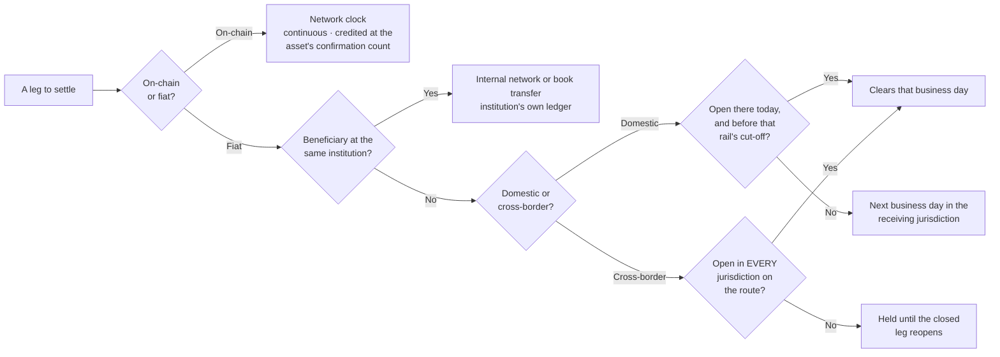

Execution and settlement run on different clocks. A trade can be agreed at 03:00
on a Sunday. The USD leg of that trade cannot move until the US banking system
opens, and the constraint lives in the rails rather than in the platform.

## Which clock governs a leg

<Warning>
**A Friday-evening crypto trade with a USD leg may not settle its dollars until
Monday.** The crypto leg can move at any hour; the wire queues behind the next
banking day in the receiving jurisdiction. You carry the counterparty exposure
across the weekend, and cash you were relying on for Monday morning arrives
during Monday rather than at the start of it. Raising it with the desk on
Saturday will not shorten it.
</Warning>

## The receiving jurisdiction's calendar is the one that counts

A US federal holiday stops Fedwire, ACH, FedNow and RTP for a London client
having an entirely normal Tuesday. A Colombian holiday stops Bre-B, Fast Pay and
ACH Colombia for a New York treasurer who has never heard of it. Dollar payments
clear through the US banking system even when neither party is American, so a USD
wire between two European counterparties inherits the US holiday calendar while
both offices are open and both parties are at their desks.

<Warning>
**A cross-border payment inherits every calendar on its route, not just the two
ends.** Where a payment passes through an intermediary bank, a closure anywhere
in that chain holds it.

It presents as a failed payment rather than a queued one: funds have left,
nothing has arrived, and chasing produces no movement until the closed leg
reopens. Where a payment date is commercially binding, ask which jurisdictions
the route touches before instructing, not only whether your bank and theirs are
open.
</Warning>

### Rails do not share a clock

| Rail | Calendar that governs it |
| --- | --- |
| Fedwire, ACH, FedNow, RTP | US banking calendar |
| EFT | Canadian banking calendar |
| Bre-B, Fast Pay, ACH Colombia | Colombian banking calendar |
| SEPA | Euro-area banking calendar |
| CHAPS, Faster Payments, BACS | UK banking calendar |
| SPEI | Mexican banking calendar |
| FAST | Singapore banking calendar |
| NPP / PayID | Australian banking calendar |
| Zengin | Japanese banking calendar |
| SWIFT | Every jurisdiction on the routing chain |
| Internal networks, book transfer | The institution's own ledger and operating hours |

Instant schemes — FedNow, RTP, Faster Payments, SPEI, Bre-B, FAST, NPP — clear
in real time and, depending on the scheme, outside conventional banking hours.
That only helps where the receiving institution participates and the rail is
enabled on your account: reachability is a property of your beneficiary's bank,
not of the scheme's existence.

<Note>
Where both sides bank at the same institution, the payment moves across that
institution's own ledger instead of a national clearing system, so it is not
bound by that system's hours. Whether a given beneficiary is reachable that way
is determined when you register them, not when you instruct — see
[Fiat settlement](/guides/settlement/fiat).
</Note>

<Warning>
Which currencies and rails you can use depends on the Trillion Digital
[entity](/guides/accounts/entities) you face, its banking partners, and your
commercial terms. The table above is what the platform supports, not what is
enabled on your account. Your onboarding documentation and your account manager
are authoritative on the difference.
</Warning>

## Crypto does not close — but it is not instant either

The networks the platform models — Bitcoin, Ethereum, Solana, Tron, Polygon,
Avalanche, BNB Chain, Cardano, Polkadot, Algorand, Ripple, Litecoin, Bitcoin
Cash, Stellar, Cosmos, NEAR, Aptos, Sui, TON, Arbitrum, Optimism and Base —
produce blocks through weekends, holidays and month-ends without distinction.
That is what the platform supports, not what is enabled on your account: which
networks, and which assets on them, follows from your entity and your commercial
terms, and your account manager is authoritative on the difference.

Two things still take time, and neither is an opening-hours question:

<CardGroup cols={2}>
  <Card title="Confirmations" icon="layer-group">
    A transfer credits once it reaches the required confirmation count for that
    asset on that network. The threshold differs per asset and network — see
    [Crypto settlement](/guides/settlement/crypto).
  </Card>
  <Card title="Congestion" icon="gauge-high">
    Network load, not the hour, is what varies. A busy chain is slower and more
    expensive at 03:00 on a Sunday than a quiet one is on a Tuesday morning.
  </Card>
</CardGroup>

The steps *before* broadcast are the ones that are not continuous. A withdrawal
sits in `PendingApproval` until it is approved internally, and a destination has
to be registered, screened and approved before it can be paid at all.

<Tip>
**A dollar leg is not necessarily a banking leg.** Settling a USD-referenced
amount as a stablecoin transfer puts it on the network clock; settling it as a
wire puts it on the banking calendar. Where weekend or holiday timing genuinely
matters, that choice — not the execution channel — is what decides when value
moves.

It is a different instrument, not a payment-routing preference: a stablecoin
balance is a claim on its issuer rather than a bank deposit, the destination
still has to be
[whitelisted](/guides/settlement/wallet-whitelisting), and which assets are
enabled on your account is set by your entity and your terms. Raise it with your
account manager before assuming it is available to you.
</Tip>

## Channels: what is open when

The portal and the API are available continuously. The high-touch desk and the
chat channels run to desk hours. This is set out per channel in
[How you can trade](/guides/trading/execution-channels).

Anything that needs a person needs desk hours: a block that has to be worked, a
price in size that the screen will not give you, a correction to a settlement
instruction, an approval that is pending. An API order placed at midnight books
at midnight; a question about that order waits.

<Warning>
**The expensive discovery is made out of hours.** A beneficiary that was never
registered, a wallet that was never whitelisted, or an instruction that needs
amending are all human-gated — registration, screening and approval do not run
to your deadline. Finding this out on a Friday evening costs the whole weekend,
because the queue does not start until the desk reopens.

Register destinations when you plan the payment, not when you make it. See
[Bank accounts](/guides/settlement/bank-accounts) and
[Wallet whitelisting](/guides/settlement/wallet-whitelisting).
</Warning>

## Confirm these before you need them

<Steps>
  <Step title="Your cut-off, per rail and per currency">
    Set per entity and per rail, and recorded in your onboarding documentation.
  </Step>
  <Step title="The holiday calendars you actually pay into">
    Your own is the least relevant one. Track the calendars of the jurisdictions
    your beneficiaries bank in, and for USD, the US calendar regardless of where
    anyone sits.
  </Step>
  <Step title="Whether your regular beneficiaries sit on an internal network">
    If they do, that route sidesteps the clearing system's hours entirely. It is
    determined at registration.
  </Step>
  <Step title="That every destination you might use is already approved">
    Including the ones you use rarely, and the ones you would only use if
    something went wrong with your usual route.
  </Step>
  <Step title="How to reach the desk when settlement is time-critical">
    For a discrepancy approaching its value date, contact your account manager
    directly as well as support — see [Contact](/guides/support/contact).
  </Step>
</Steps>

<Note>
Cut-off times, desk hours, and the holiday calendars applicable to your account
are specific to your entity and your banking partners. Your onboarding
documentation records them and your account manager is the source of truth,
which is why no times appear on this page.
</Note>
