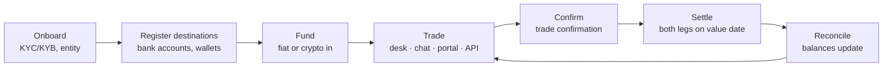

Trillion Digital is an institutional OTC desk for digital assets. Clients trade
bilaterally against our liquidity rather than on a public order book, and settle
in fiat or crypto through their own designated accounts and wallets.

This section explains how that works operationally. If you are looking to
integrate programmatically, go to the
[Trading API](/trading-api/overview) instead.

## The lifecycle

<Warning>
Registering destinations sits **before** funding for a reason. Screening and
approval take time, and a trade cannot settle to a destination that has not
cleared. Leaving it until a trade is already executing is the single most common
cause of a delayed settlement.
</Warning>

<Steps>
  <Step title="Onboard">
    Entity verification, KYC/KYB on beneficial owners, and account opening. See
    [Onboarding](/guides/accounts/onboarding).
  </Step>
  <Step title="Fund">
    Move fiat or crypto into your designated account or wallet. See
    [Settlement](/guides/settlement/overview).
  </Step>
  <Step title="Trade">
    Request a quote, accept it, and receive a trade confirmation — through the
    high-touch desk, chat, the portal, or the API. See
    [How OTC trading works](/guides/trading/how-otc-trading-works) and
    [Execution channels](/guides/trading/execution-channels).
  </Step>
  <Step title="Settle">
    Both legs move on the agreed value date, against your standing settlement
    instructions. See
    [Settlement instructions](/guides/settlement/settlement-instructions).
  </Step>
</Steps>

## Key concepts

<AccordionGroup>
  <Accordion title="Bilateral, not exchange">
    You are trading against Trillion Digital as principal counterparty, not
    matching against other clients. Prices are quoted to you specifically, which
    is why size does not move a public book against you.
  </Accordion>
  <Accordion title="RFQ is the normal path">
    Most flow is request-for-quote: you ask for a price in a given size, receive
    a firm two-way quote valid for a short window, and choose whether to trade.
    See [RFQ workflow](/guides/trading/rfq-workflow).
  </Accordion>
  <Accordion title="Settlement is separate from execution">
    A trade is agreed at execution and settled afterwards. The gap between the
    two is where settlement instructions, whitelisting, and cut-off times matter.
  </Accordion>
  <Accordion title="Entities are segregated">
    Trillion Digital operates through distinct regulated entities. Which one you
    face determines your account, your settlement rails, and your regulatory
    relationship. See [Entities](/guides/accounts/entities).
  </Accordion>
</AccordionGroup>

<Note>
Commercial terms — fees, spreads, credit limits, supported instruments, and
cut-off times — are specific to your relationship and are set out in your
onboarding documentation. Your account manager is the source of truth for those,
not this site.
</Note>
