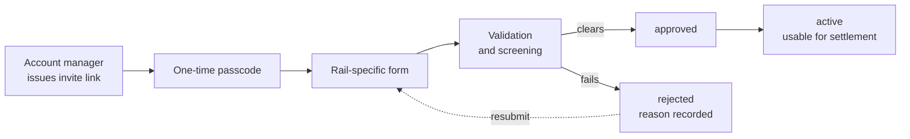

Fiat settles only to bank accounts that have been registered, verified, and
approved. This is the fiat counterpart of
[wallet whitelisting](/guides/settlement/wallet-whitelisting), and it exists for
the same reason: a payment instruction is far safer to check once, in advance,
than under time pressure on a settlement date.

## How an account is registered

Bank details are usually collected through a **secure invitation link** rather
than by email, so account numbers never sit in a mailbox.

<Steps>
  <Step title="You receive an invitation">
    Your account manager issues a single-use link for the account you want to
    register.
  </Step>
  <Step title="Verify it is you">
    The link is confirmed with a one-time passcode before any form is shown.
  </Step>
  <Step title="Submit the details">
    The form adapts to the rail — a Fedwire account asks for a routing number, a
    SEPA account for an IBAN, an internal-network beneficiary for that network's
    identifier. See [Fiat settlement](/guides/settlement/fiat) for what each rail
    needs.
  </Step>
  <Step title="Review and screening">
    We validate the details, screen the beneficiary, and check the account
    against the entity that will be paying it.
  </Step>
  <Step title="Approval">
    Once approved the account becomes usable for settlement.
  </Step>
</Steps>

<Warning>
Never send bank details over email or chat, and treat any request to do so as
suspicious — including one that appears to come from us. Registration happens
through the invitation link, and we will verify any change through an independent
channel. See [Security](/guides/compliance/security).
</Warning>

## What you will be asked for

<AccordionGroup>
  <Accordion title="Beneficiary">
    The **legal** account name exactly as the receiving bank holds it, and a
    complete address — street, town, and country. Trading names and abbreviated
    addresses are the two most common causes of a later rejection.
  </Accordion>
  <Accordion title="Account identifiers">
    Account number, IBAN, CLABE, or the internal-network identifier, depending on
    the rail.
  </Accordion>
  <Accordion title="Bank">
    Bank name, address, and routing identifier — ABA for Fedwire, BIC for SWIFT,
    sort code for the UK.
  </Accordion>
  <Accordion title="Intermediary bank">
    Where the receiving bank requires one for international payments.
  </Accordion>
  <Accordion title="Supporting documents">
    A bank statement or letter may be requested to evidence that the account
    belongs to you.
  </Accordion>
</AccordionGroup>

## Status

| Status | What it means |
| --- | --- |
| `pending` | Submitted, not yet picked up for review |
| `pending_review` | Under review and screening |
| `approved` | Cleared, and available for settlement |
| `active` | In use as a settlement destination |
| `rejected` | Not accepted — a reason is recorded and shared with you |

<Note>
Only an approved account can receive a settlement. If a trade is executing before
your account has cleared review, tell your account manager early — approval is
not something that can be compressed on the settlement date.
</Note>

## Changing an account

Changes are treated as a **new registration**, not an edit. The replacement is
re-verified and re-screened, and the old account is retired once the new one
clears.

<Warning>
Bank detail changes are the single most targeted vector for payment fraud. The
pattern is a convincing request to change details, often from a compromised or
lookalike email address, timed around a known settlement.

We will independently verify any change before applying it. Treat pressure to
skip that verification — urgency, a claimed deadline, a new contact number — as
the strongest possible signal that the request is fraudulent.
</Warning>

## Multiple accounts

Register one account per currency and rail you settle in. Accounts are not
interchangeable across currencies, and an account registered against one Trillion
Digital [entity](/guides/accounts/entities) is not visible to another.

One account can be marked as your default for a given currency, which is the one
used when an instruction does not name another.

## Third-party accounts

Settlement is to accounts in your own name. An account in a different name
requires compliance review in advance and is not accepted as routine.

## Keeping the list tight

Ask us to remove accounts you no longer use. A short, current whitelist is a
meaningful control rather than housekeeping — every retired account left in place
is one more destination that could be selected by mistake.
