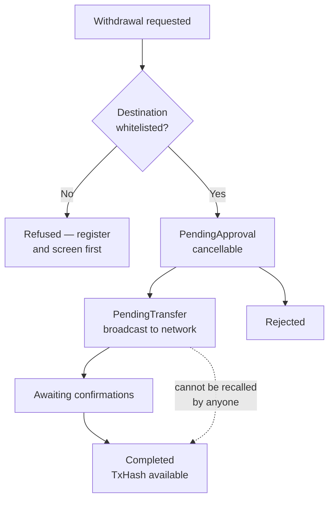

Crypto settles on-chain to whitelisted wallet addresses.

<Warning>
Note where cancellation stops being possible. Once a transaction is broadcast it
is beyond the platform's control **and beyond anyone's** — that is a property of
the blockchain, not a limitation we could lift.
</Warning>

## Before you can settle

Every destination address must be
[whitelisted](/guides/settlement/wallet-whitelisting) first — registered,
screened, and approved. There is no ad-hoc withdrawal path.

## Networks matter as much as addresses

Many assets exist on multiple networks. A whitelisted address is registered
**for a specific asset on a specific network**.

<Warning>
Sending an asset to an address on the wrong network is generally
**unrecoverable**. The same address string can be valid on several EVM chains
while the funds are only accessible on one of them. Always confirm the network,
not just the address.
</Warning>

## Memos and destination tags

Some networks require a memo or destination tag in addition to the address. Where
one is required and omitted, funds may be credited to the wrong account at the
receiving institution and can be difficult or impossible to recover.

Register the memo or tag alongside the address so it is applied automatically.

## Confirmations

An on-chain transfer is credited once it reaches the required number of network
confirmations. The threshold varies by asset and network, reflecting each
chain's settlement assurance.

Transfers progress through:

| Status | Meaning |
| --- | --- |
| `PendingApproval` | Awaiting internal approval — still cancellable |
| `PendingTransfer` | Approved, being broadcast |
| `Completed` | Confirmed on-chain and credited |
| `Rejected` | Not processed |

Once broadcast, a transaction hash is available for independent verification on a
block explorer.

<Tip>
The `TxHash` is the one piece of evidence neither side controls. If a transfer is
disputed, quoting it settles the question faster than any amount of describing
what your system believes happened.
</Tip>

### Why thresholds differ

Confirmation counts are not arbitrary. Each chain offers different settlement
assurance per block, so the threshold reflects how long it takes for a
reorganisation to become implausible on that network. A chain with fast blocks
typically needs more of them to reach the same confidence as a chain with slow
ones.

This is why a transfer on one network credits in minutes and another takes
longer, even for the same nominal value — and why the number is set per asset and
network rather than globally.

<Note>
Only `PendingApproval` transfers can be cancelled. Once a transaction is broadcast
to the network it cannot be recalled by anyone — that is a property of the
blockchain, not a platform limitation.
</Note>

## Network fees

On-chain transfers incur a network fee, which varies with congestion. How it is
applied to your transfer is set out in your commercial terms.

## Incoming deposits

Deposit to the address provided for your account, for that asset and network.

<Warning>
Deposit addresses are asset- and network-specific. Sending an asset to an address
issued for a different asset or network risks permanent loss. Re-check the
address each time rather than reusing one from an old email.
</Warning>

## Over the API

Withdrawals are requested with
[`NewWithdrawRequest`](/trading-api/websocket/commands#newwithdrawrequest).
Prefer `AddressID` referencing a whitelisted address over supplying
`RoutingInfo` inline — the two are mutually exclusive, and referencing a
pre-approved address avoids re-screening delay.
