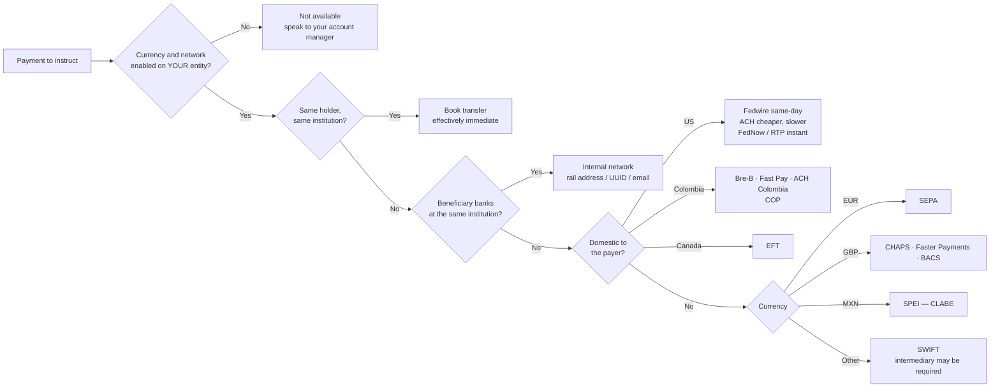

Fiat settles by transfer against your registered
[settlement instructions](/guides/settlement/settlement-instructions). Which rail
a payment takes depends on the currency, the destination country, and — often
decisively — **where your beneficiary banks**.

## The four kinds of rail

<CardGroup cols={2}>
  <Card title="Domestic wire" icon="building-columns">
    In-country clearing systems. Fedwire and ACH in the US, EFT in Canada,
    Colombia's local rails.
  </Card>
  <Card title="International wire" icon="globe">
    Cross-border and multi-currency. SWIFT, SEPA, and local instant schemes such
    as SPEI and Faster Payments.
  </Card>
  <Card title="Internal network" icon="arrows-left-right">
    Both sides bank at the same institution, so the payment never touches an
    external clearing system. Usually instant. See below.
  </Card>
  <Card title="Book transfer" icon="right-left">
    A move between **your own** accounts at one institution. Effectively
    immediate.
  </Card>
</CardGroup>

<Warning>
Book transfer and internal network are **not** the same thing, and confusing them
is the most common reason an instruction is set up wrong.

A **book transfer** moves funds between accounts belonging to the same holder.
An **internal network** transfer pays a *different* customer who happens to bank
at the same institution. Institutions enforce this: on the Erebor network, for
example, a rail transfer addressed to your own account is refused outright with
`SELF_TRANSFER_NOT_ALLOWED` — that move has to be a book transfer instead.
</Warning>

## Which rail will my payment take?

<Note>
You do not pick the rail yourself. It falls out of the beneficiary you register
and the currency you settle in — which is why getting the registration right
matters more than anything you do at instruction time.
</Note>

## Internal settlement networks

When your beneficiary banks at the same institution we do, the payment can move
across that institution's own ledger rather than through Fedwire or SWIFT. This
is faster, cheaper, and materially less likely to fail, because none of the
correspondent-banking machinery is involved.

Each network identifies the beneficiary its own way — **not** by routing number
and account number.

| Network | Currency | Beneficiary identified by |
| --- | --- | --- |
| **Erebor Network** | USD | Rail address — `@handle`, or `@routing/account` such as `@044016018/987654321` |
| **CUBIX Network** | USD | Partner account UUID, plus account number |
| **FVNet** | USD | Email, plus account number and bank details |
| **Coinbase Network** | USD | Account identifier held at Coinbase |
| **SoFi SEN** | USD | Account identifier held at SoFi |
| **Anchorage Atlas** | USD | Account identifier held at Anchorage |
| **At Banesco** (Banesco USA) | USD | Account number and email — an on-us transfer inside Banesco |
| **BitGo GoNetwork** | USD | Go Account ID |
| **Bitso** | **MXN** | Email. Mexico |

<Note>
**Internal networks are not all USD.** Most are — they exist to move dollars
between customers of the same US institution without touching Fedwire — but
Bitso settles Mexican pesos, and the network you use is therefore partly
determined by the currency you are settling in, not only by where your
beneficiary banks.
</Note>

<Note>
Availability varies by entity and by which institutions you and your beneficiary
bank with. Some of these are arranged through your account manager rather than
self-registered. If a network you expect is not offered when you register a
beneficiary, ask — it may be available on your account without appearing in the
self-service form.
</Note>

Where a network is selectable on a settlement instruction it carries a rail code:
`erebor`, `cubix`, `fvnet`, `bitso`, `bitgo`, and `intra_bank` — the last covering
At Banesco and other on-us transfers inside a beneficiary's own bank.

<Note>
You do not normally choose the network. When you register a beneficiary, we
determine whether they are reachable on an internal rail and register them
accordingly. Where a bank tells us a beneficiary is already one of its customers,
using the internal rail is not optional — the institution will reject the wire
and require the rail address instead.
</Note>

<Warning>
**A rail address is resolved when it is created, and is then immutable.** A
malformed or mistyped address cannot be edited afterwards; the registration has
to be replaced. This is why we validate the format up front and why a beneficiary
change is treated as a new registration rather than an edit — see
[Settlement instructions](/guides/settlement/settlement-instructions).
</Warning>

## Currencies and the rails that carry them

| Currency | Rails |
| --- | --- |
| **USD** | Fedwire, ACH, FedNow, RTP, SWIFT, plus every USD internal network |
| **EUR** | SEPA, SWIFT |
| **GBP** | CHAPS, Faster Payments, BACS, SWIFT |
| **COP** | Bre-B, Fast Pay, ACH Colombia |
| **MXN** | SPEI, Bitso |
| **CAD** | EFT, SWIFT |
| **SGD** | FAST, SWIFT |
| **AUD** | NPP / PayID, SWIFT |
| **JPY** | Zengin, SWIFT |

<Warning>
**Your entity determines which of these you can actually use.** Trillion Digital
operates through separate regulated entities, each with its own banking partners,
and a currency or network supported by the platform is not necessarily enabled on
your account.

A currency available through the US entity may be unavailable through the Swiss
one and vice versa, and the same is true of internal networks — they depend
entirely on which institutions your entity banks with. This is settled at
onboarding, not at instruction time.

Treat the tables on this page as **what the platform supports**, and your
onboarding documentation as **what you can use**. Where they differ, your
account manager is authoritative.
</Warning>

## Domestic rails

| Rail | Code | Country | Notes |
| --- | --- | --- | --- |
| Fedwire | `fedwire` | US | Same-day domestic wire |
| ACH | `ach` | US | Lower cost, slower than wire |
| FedNow | `fednow` | US | Instant payments |
| RTP | `rtp` | US | Real-time payments |
| EFT | `eft` | CA | Canadian electronic funds transfer |
| Bre-B | `breb` | CO | Colombian instant payments, addressed by Bre-B key |
| Fast Pay | `fast_pay` | CO | Direct bank-to-bank payout |
| ACH Colombia | `ach_co` | CO | Colombian interbank transfer |

## International rails

| Rail | Code | Scope | Notes |
| --- | --- | --- | --- |
| SWIFT | `swift` | Global | Cross-border wire; may route via an intermediary |
| Wire | `wire` | Global | Generic international wire |
| SEPA | `sepa` | Euro area | Euro transfers |
| CHAPS | `chaps` | UK | Same-day high value |
| Faster Payments | `faster_payments` | UK | Instant |
| BACS | `bacs` | UK | Standard, around three days |
| SPEI | `spei` | MX | Mexican instant transfers, addressed by CLABE |
| FAST | `fast` | SG | Singapore instant transfers |
| NPP / PayID | `npp` | AU | Australian real-time payments |
| Zengin | `zengin` | JP | Japanese domestic transfers |
| CRNow | `crnow` | Global | Uses standard wire instructions |

<Note>
Availability is not universal. Which rails you can actually use depends on your
facing [entity](/guides/accounts/entities), the currency, and the banking
partners behind that entity. Your account manager confirms what applies to your
account — this table is the full set the platform supports, not a promise that
all of it is enabled for you.
</Note>

## What identifiers each rail needs

Different rails validate different fields, which is why the registration form
changes as you pick one.

<AccordionGroup>
  <Accordion title="US domestic — Fedwire, ACH, FedNow, RTP">
    Beneficiary name, account number, routing number (ABA), and a complete
    beneficiary address.
  </Accordion>
  <Accordion title="International — SWIFT and friends">
    Beneficiary name, account number or IBAN, BIC/SWIFT, complete beneficiary
    **and** bank addresses, and an intermediary bank where the receiving bank
    requires one. European beneficiaries need an IBAN; the UK routes on sort code
    and account number instead.
  </Accordion>
  <Accordion title="Mexico — SPEI">
    CLABE rather than a conventional account number.
  </Accordion>
  <Accordion title="Colombia — Bre-B, Fast Pay, ACH Colombia">
    A Bre-B key for Bre-B; for the others, account type, institution code, and
    the beneficiary's document type and number.
  </Accordion>
  <Accordion title="Internal networks">
    The network's own identifier — see the table above. Routing and account
    numbers are usually not the addressing mechanism.
  </Accordion>
</AccordionGroup>

## What makes a payment fail

<AccordionGroup>
  <Accordion title="Incomplete beneficiary address">
    The most common cause of a bounced wire. Wire rails require a **complete**
    address — street, town, and country — on both the beneficiary and the bank.
    A missing town or country is enough to have the payment returned, often days
    later.
  </Accordion>
  <Accordion title="Beneficiary banks with the same institution">
    Some banks refuse a wire to their own customer and require the internal rail
    instead. The instruction has to be re-registered as a rail address.
  </Accordion>
  <Accordion title="Self-transfer over an internal rail">
    Internal networks are for paying *other* customers. Moving money between your
    own accounts is a book transfer.
  </Accordion>
  <Accordion title="Unregistered destination">
    Payments go only to registered, screened instructions. An ad-hoc destination
    supplied at instruction time will not be used.
  </Accordion>
  <Accordion title="Name mismatch">
    The beneficiary name must match the account name at the receiving bank.
    Trading names that differ from the registered legal name cause rejections.
  </Accordion>
  <Accordion title="Missing intermediary details">
    Some international payments require an intermediary bank. If the receiving
    bank requires one and it is absent, the payment fails in transit.
  </Accordion>
  <Accordion title="Missed cut-off">
    An instruction after cut-off is processed the next business day.
  </Accordion>
</AccordionGroup>

<Warning>
A returned wire is not instant to unwind. Funds can be in transit for days before
the return lands, and the return itself takes time. Getting beneficiary details
complete and correct at registration is far cheaper than correcting them
afterwards.
</Warning>

## Third-party payments

Settlement is to accounts in **your own name**. Payments to third parties are not
supported as a matter of course and require compliance review in advance.

<Warning>
Do not assume a third-party instruction will be processed because it was accepted
for registration. Raise it with compliance before relying on it commercially.
</Warning>

## Incoming funds

When sending funds to Trillion Digital, use the account details and any reference
provided for your account.

<Warning>
Include the reference. Deposits arriving without one require manual
identification before they are credited, which delays the funds and, if you were
funding a trade, can delay settlement.
</Warning>
