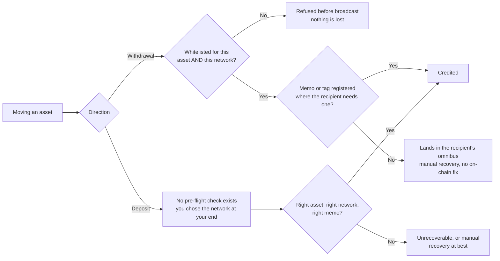

An asset is what you own. A network is where the record of that ownership lives.
The platform treats the two as a pair, and most of the constraints on this page
fall out of that: a whitelisted address is approved for one asset on one network,
a deposit address is issued for one asset on one network, and a transfer that
gets the asset right and the network wrong is not a late transfer — it is a
different transfer.

## Trading is asset-level, settlement is network-level

Instruments are quoted as `BASE-QUOTE` — see
[Instruments](/guides/trading/instruments). Nothing in that symbol names a chain,
because at the point of dealing there is nothing to name. Buying USDC commits you
to receiving USDC; **which network delivers it is decided afterwards, by the
address you settle to.**

A trade can be priced, agreed and booked correctly and still have nowhere to go,
because the crypto leg has no approved destination on any network enabled for
your account. Nothing in the dealing flow checks this. Whitelisting involves
screening and, for some address types, ownership verification — so the gap does
not close on the day you notice it. See
[Wallet whitelisting](/guides/settlement/wallet-whitelisting).

## Networks the platform models

| Family | Networks | Why the grouping matters |
| --- | --- | --- |
| **EVM** | Ethereum, Polygon, Avalanche, BNB Chain, Arbitrum, Optimism, Base | One address format across all seven. A transfer sent to a valid address on the wrong chain confirms successfully |
| **Memo / destination tag** | Ripple, Stellar, Cosmos, TON, Algorand | The address may identify an institution rather than you; a second field routes the funds to your account |
| **Distinct formats** | Bitcoin, Bitcoin Cash, Litecoin, Solana, Tron, Cardano, Polkadot, NEAR, Aptos, Sui | Address formats differ enough that a mismatch usually fails validation instead of sending |

## Assets the platform models

| Class | Assets | Network implication |
| --- | --- | --- |
| **Network natives** | BTC, ETH, SOL, XRP, TRX, LTC, BCH, AVAX, DOT, ADA, ALGO, XLM, MATIC | The asset mostly determines the chain — with one large exception, below |
| **Stablecoins** | USDT, USDC, DAI, PYUSD, EURC | Issued on many chains at once. The network is a free variable and must be stated explicitly |
| **Other tokens** | LINK | Lives on a chain it is not native to; same problem as a stablecoin, smaller blast radius |

<Note>
**ETH is not a single-network asset.** Ether is native to Ethereum and also
circulates on Arbitrum, Optimism and Base, all of which the platform models.
Treating ETH the way you treat BTC — one asset, one chain, one address — is the
same mistake as treating USDC that way, and it is easier to make because ETH
looks like a native coin.
</Note>

<Note>
**The two lists above do not line up, deliberately.** Arbitrum, Optimism, BNB
Chain, Aptos, Sui, TON, Cosmos and NEAR are modelled as places assets can settle,
and none of their native tokens appears in the asset list.
</Note>

<Warning>
Both tables are **what the platform supports, not what you are offered.** What is
actually enabled depends on the Trillion Digital
[entity](/guides/accounts/entities) you face, the banking and custody partners
behind it, and your commercial terms. Your account manager and your onboarding
documentation are authoritative; this page is not.
</Warning>

## Stablecoins are where this bites

In your accounting, USDC is one line. Operationally it is as many distinct things
as there are chains carrying it, and each one needs its own whitelisted address,
its own deposit address, and its own answer to "did it arrive".

<Warning>
**A wrong-chain EVM transfer succeeds.** The seven EVM networks share an address
format, so the address you hold for a counterparty on Ethereum is syntactically
valid on Base, Arbitrum, Optimism, Polygon, BNB Chain and Avalanche. Send there
and the transaction confirms, the explorer shows success, and the tokens sit at
that address on a chain nobody may be able to sign for.

Recovery depends entirely on whoever controls that address holding keys usable on
the destination chain **and** being willing to do the work. For an exchange or
custodian deposit address, that is frequently nobody, and the funds are gone.

The mistakes that fail loudly — a Tron address pasted into a Solana field, a
Bitcoin address into an Ethereum one — are the safe ones.
</Warning>

<Note>
**The ticker is not the token.** Some chains carry more than one asset calling
itself USDC — one issued natively, one bridged from elsewhere — and they are
different contracts that a recipient may treat differently or not credit at all.
When you whitelist, confirm the token with the receiving institution, not just
the chain.
</Note>

<Tip>
EURC is euro-referenced, not dollar-referenced. If you hold stablecoins as a cash
proxy, group them by the currency they track rather than by the fact that they
are stablecoins — otherwise a euro position ends up inside a dollar balance in
your own reporting.
</Tip>

## Memo and destination-tag networks

On Ripple, Stellar, Cosmos, TON and Algorand, an institution commonly operates
**one on-chain account for many customers**. The address gets funds to the
institution. A memo, destination tag or note field is what gets them to you.

<Warning>
**Omit the memo and the transfer still succeeds.** It confirms on-chain, the hash
is valid, and the funds credit the receiving institution's omnibus account rather
than yours. There is no on-chain remedy — the transaction did exactly what it was
told. Resolution is a manual reconciliation request at another company, on their
timetable and at their discretion.

Register the memo alongside the address so it is applied automatically rather
than typed each time.
</Warning>

Whether a memo is needed is a property of the **destination**, not of the
network. The same XRP sent to a self-custodied wallet needs no tag and sent to an
exchange deposit account needs one. Ask the recipient; do not infer it from the
chain.

## Where the platform can stop you, and where it cannot

On withdrawals, the asset-and-network binding on a whitelisted address is a real
control: a transfer to a chain you have not registered is refused rather than
broadcast, and refusal costs you a delay. See
[Crypto settlement](/guides/settlement/crypto).

On deposits there is no equivalent gate. The network is chosen in whatever wallet
or exchange you are sending from, and the first the platform knows of a
wrong-chain deposit is that it never arrives. Deposit addresses are issued per
asset **and** network, so re-check the address each time rather than reusing one
from an old email — the one you saved may have been for a different pair.

## Finding out what you can actually trade

Three views of the same entitlement set, all live:

<CardGroup cols={3}>
  <Card title="API" icon="code" href="/trading-api/websocket/streams/security">
    Subscribe to the `Security` stream. The initial message is a snapshot of
    every security available to you; everything after is a delta.
  </Card>
  <Card title="Portal" icon="display">
    The instrument selector lists what your account can deal —
    [trading.trilliondigital.io](https://trading.trilliondigital.io), or
    `sandbox.trading.trilliondigital.io` if you are building against sandbox.
  </Card>
  <Card title="Chat" icon="comments">
    `/pairs` returns the instruments enabled on your account, in your dealing
    channel.
  </Card>
</CardGroup>

<Note>
Do not maintain a hardcoded instrument list. Securities are added and disabled
over time, and a removed security arrives on the `Security` stream as an
`UpdateAction` of `Remove` rather than as an error at order time.
</Note>

<Warning>
**Neither the `Security` stream nor the `Currency` stream carries a network.**
`Security` gives you `BaseCurrency`, `QuoteCurrency` and `SettlementCurrency`;
`Currency` gives you a symbol and its increment. Nothing there tells you which
chains you can settle USDC on.

That information lives in your whitelisted addresses and in what your account
manager has enabled — so an integration that derives "we can trade this" from the
`Security` stream is correct, and one that derives "we can settle this" from it
is not.
</Warning>

## The fiat equivalent

The currency is the asset; the rail and the institution together are the network.

Rail support exists at platform level for **USD, EUR, GBP, COP, MXN, CAD, SGD,
AUD and JPY**, and dedicated banking integrations exist for **Anchorage, Cobre,
Cross River, Customers Bank, Erebor and FV Bank** — which is why the same USD
reaches one beneficiary over Fedwire and another over an internal network without
touching Fedwire at all. Which of either applies to you follows from your
[entity](/guides/accounts/entities) and is settled at onboarding, so treat both
lists as what the platform supports and your account manager as the record of
what you can use. The full rail set, the internal networks and the identifiers
each one addresses by are in [Fiat settlement](/guides/settlement/fiat).

A fiat payment sent on the wrong rail or to an incomplete beneficiary bounces:
slow, irritating, and recoverable. A crypto transfer sent to the wrong network
does not bounce, which is why the whitelist binds an approval to one network
rather than to an address alone.

## Establish these at onboarding

Your account manager, not this documentation, holds the answers:

<AccordionGroup>
  <Accordion title="Which assets are enabled, and on which networks each">
    Two separate answers. "We support USDC" and "we can settle USDC on Solana for
    you" are different statements, and only the second lets you plan a flow.
  </Accordion>
  <Accordion title="Which of your counterparties need a memo or tag">
    Confirm per destination, from the destination, before the address is
    whitelisted rather than after a transfer goes missing.
  </Accordion>
  <Accordion title="Which fiat currencies your entity can settle">
    Determined by your facing [entity](/guides/accounts/entities) and its banking
    partners, not by the platform's overall currency list.
  </Accordion>
  <Accordion title="Confirmation thresholds on the networks you will use">
    Set per asset and network, and they differ enough to change how you plan a
    same-day flow. Your account manager holds the current numbers.
  </Accordion>
  <Accordion title="How network fees are applied to your transfers">
    Set out in your commercial terms rather than published per asset.
  </Accordion>
</AccordionGroup>
