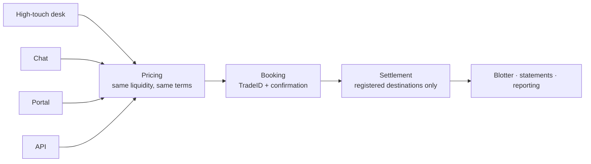

Trillion Digital distributes the same liquidity through four channels. They are
not tiers, and most clients use more than one: a desk might run systematic flow
over the API and pick up the phone for a block that needs working.

<CardGroup cols={2}>
  <Card title="High-touch OTC" icon="phone">
    Deal directly with a trader. For size, illiquid pairs, and anything that
    needs to be worked or structured.
  </Card>
  <Card title="Chat" icon="comments">
    Quote and trade from Telegram, Slack, or WhatsApp. Conversational, with an
    audit trail.
  </Card>
  <Card title="Portal" icon="display">
    The web terminal. Self-service RFQ, blotter, balances, statements. No
    development required.
  </Card>
  <Card title="API" icon="code">
    WebSocket, REST, or FIX. For automation and systematic flow.
  </Card>
</CardGroup>

## They converge

Whichever channel you use, the trade lands in the same place and settles the same
way. The channel decides how the request reaches us — nothing downstream of that.

<Note>
Pricing is not a function of the channel. The same trade in the same size prices
the same whether it is requested by phone, chat, portal, or API. The channel
determines convenience and workflow, not economics.
</Note>

## Choosing a channel

| | High-touch | Chat | Portal | API |
| --- | --- | --- | --- | --- |
| **Best for** | Large or complex trades | Ad-hoc dealing on the move | Day-to-day manual trading | Automation, systematic flow |
| **Price discovery** | Negotiated with a trader | RFQ | RFQ and streaming | RFQ and streaming |
| **Setup required** | None | Channel provisioning | Login | Integration work |
| **Human in the loop** | Yes | Yes, when needed | No | No |
| **Available** | Desk hours | Desk hours | 24/7 | 24/7 |
| **Audit trail** | Call and ticket | Message history | Blotter | Blotter |

<Tip>
The decision is usually about **size relative to the market**, not about your
sophistication. A quantitative desk with a full API integration should still call
for a block that would move the screen — and a discretionary client who trades by
phone can perfectly well pull statements over the API.
</Tip>

## High-touch OTC

Speak or message directly with a trader. The right channel when execution
strategy matters: the trade is large enough that how it is worked affects the
outcome, the pair is thin, you want it worked over a period rather than filled at
a point, or the structure is not a simple spot exchange.

<Steps>
  <Step title="Reach the desk">
    Through your account manager or the dealing channel established during
    onboarding.
  </Step>
  <Step title="Describe the trade">
    Instrument, size, and any constraints on execution. Disclose direction only
    if you want to.
  </Step>
  <Step title="Receive a price">
    Quoted for your specific size, not a screen price you then try to fill.
  </Step>
  <Step title="Confirm">
    On agreement the trade is booked and a confirmation is issued, exactly as
    with any other channel.
  </Step>
</Steps>

**Have ready when you call:** the instrument and size, the currency the size is
expressed in, your settlement date expectation, and — if it matters to you — any
constraint on how the order is worked.

<Tip>
If a quote you can see in the portal or over the API looks wrong for the size you
want, that is precisely the moment to call rather than trade on it. Screen
liquidity is not the whole of what the desk can do, and a price that looks poor
in size is often a sign that the trade wants working rather than filling.
</Tip>

## Chat

Quote and trade from **Telegram, Slack, or WhatsApp**, in a channel provisioned
for your account. Popular with treasury teams who want dealing to sit alongside
the rest of their operational conversation, and useful when you are away from a
terminal.

### What you can do

| Command | Purpose |
| --- | --- |
| `/price` | Indicative price check |
| `/quote` | Request a firm quote (opens an RFQ) |
| `/book` | Book the trade |
| `/modify` | Amend a working order |
| `/cancel` | Cancel |
| `/pairs` | List the instruments enabled on your account |
| `/balance` | Current balances |
| `/trades` | Recent trade history |
| `/ssi` | Retrieve settlement instructions as a PDF |
| `/whitelisting` | Wallet whitelisting |
| `/status` | Service status |
| `/help` | The authoritative command list for your channel |

<Note>
Send `/help` in your own channel rather than relying on this table. It reflects
exactly what your account is entitled to, which a documentation page cannot.
</Note>

<Note>
In **Slack** the bot is invoked by mentioning it rather than by a bare slash
command, so that it only responds when addressed. Telegram and WhatsApp take
commands directly.
</Note>

### Two things to know

<Warning>
**Channels are provisioned per group.** If your group is upgraded or migrated by
the messaging platform — a Telegram group becoming a supergroup is the common one
— its identifier changes and the bot goes quiet in that group while continuing to
work everywhere else. That looks like an outage and is not one. Tell us and we
re-provision it.
</Warning>

<Warning>
Anyone who can post in the channel can act on your account. Treat membership of a
dealing channel as you would treat a login: review it when people join or leave,
and tell us to remove access at the same time you remove their platform access.
</Warning>

## Portal

The web terminal at
[trading.trilliondigital.io](https://trading.trilliondigital.io), with sandbox at
`sandbox.trading.trilliondigital.io`.

Request quotes and trade, review your blotter, check balances, and pull
statements and confirmations. Access is provisioned during onboarding — see
[Users and roles](/guides/accounts/users-and-roles). Every user is named and
enrols multi-factor authentication.

<Tip>
The portal is the fastest way to answer "what actually happened" when a
downstream system disagrees. The blotter is the same record the API serves, so
checking there first usually settles whether you have an integration problem or a
trade problem.
</Tip>

## API

Programmatic access for automation, market-making, and systematic strategies.

<CardGroup cols={3}>
  <Card title="WebSocket" href="/trading-api/websocket/overview">
    The primary interface. Market data, RFQ, order entry, fills, balances.
  </Card>
  <Card title="REST" href="/trading-api/rest/overview">
    Reference and historical data.
  </Card>
  <Card title="FIX 4.4" href="/trading-api/fix/overview">
    For firms with existing FIX infrastructure.
  </Card>
</CardGroup>

Start at the [Trading API quickstart](/trading-api/quickstart), and build against
sandbox before requesting production credentials — see
[Environments](/trading-api/environments). If you are unsure whether you want the
Trading API or the Platform API, see
[Which API do I need?](/choosing-an-api).

## Moving between channels

Channels are not exclusive and nothing needs to be re-set-up to switch. A single
relationship commonly runs several at once:

- Systematic flow over the **API**, with the **desk** for blocks.
- **Portal** for day-to-day dealing, **chat** when travelling.
- **API** for reporting and reconciliation, whatever executes the trades.

<Warning>
One thing does not follow you between channels: **settlement setup**. Trading
through a new channel does not re-open registration, and it does not create a
route to pay a destination that has not been approved. A trade agreed by phone
still settles only to a registered
[bank account](/guides/settlement/bank-accounts) or
[whitelisted wallet](/guides/settlement/wallet-whitelisting), against your
[settlement instructions](/guides/settlement/settlement-instructions).
</Warning>
