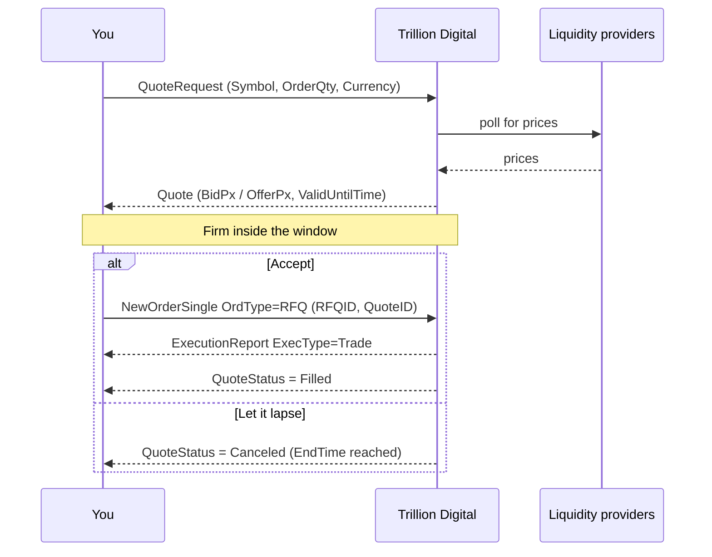

Request-for-quote is the primary way institutional flow executes on the platform.

## The flow




<Steps>
  <Step title="Request">
    Specify the instrument, the quantity, and which currency the quantity is
    expressed in. Optionally specify a side; leave it blank for a two-way price.
  </Step>
  <Step title="Quote">
    A firm quote is returned — bid, offer, or both — with an expiry time.
  </Step>
  <Step title="Decide">
    Accept, let it expire, or cancel. The price does not move against you inside
    the window.
  </Step>
  <Step title="Execute">
    On acceptance the trade is struck at the quoted price and a confirmation is
    issued.
  </Step>
  <Step title="Settle">
    Both legs move on the agreed value date against your registered settlement
    instructions.
  </Step>
</Steps>

## Specifying size

The most consequential detail in an RFQ is **which currency the quantity is in**.

<CodeGroup>
```text Base currency
Symbol:   BTC-USD
Currency: BTC
OrderQty: 0.75

→ "I want to trade 0.75 BTC"
```

```text Quote currency
Symbol:   BTC-USD
Currency: USD
OrderQty: 50000

→ "I want to trade $50,000 worth of BTC"
```
</CodeGroup>

<Warning>
Both are valid and they mean very different things. Specify `Currency`
explicitly rather than relying on a default — this is a common and expensive
mistake when automating.
</Warning>

## One-way and two-way

Leaving the side blank returns a **two-way** price — both bid and offer — without
revealing your direction. Specifying a side returns a one-way price.

<Tip>
Two-way quotes do not disclose your intent, which is generally preferable. Ask
one-way only when your direction is already known to us or you want the tightest
possible price on a specific side.
</Tip>

## Expiry

Quotes expire automatically — by default after about three minutes. The quote's
own `ValidUntilTime` is authoritative.

If a quote expires before you accept it, request a new one. The new price will
reflect the market at that moment and may differ.

## Cancelling

An open RFQ can be cancelled before it is accepted or expires. Cancelling is
courteous when you have decided not to trade, and it releases any provisional
credit consumption.

## Doing this over the API

See [Quote (RFQ)](/trading-api/websocket/streams/quote) for the message flow, and
[Commands](/trading-api/websocket/commands#rfq) for payloads.

<Warning>
Subscribe to the `Quote` **and** `ExecutionReport` streams before sending a quote
request. Quote responses arrive on `Quote`, but the resulting trade arrives on
`ExecutionReport` — subscribing after the fact means missing your own fill.
</Warning>
