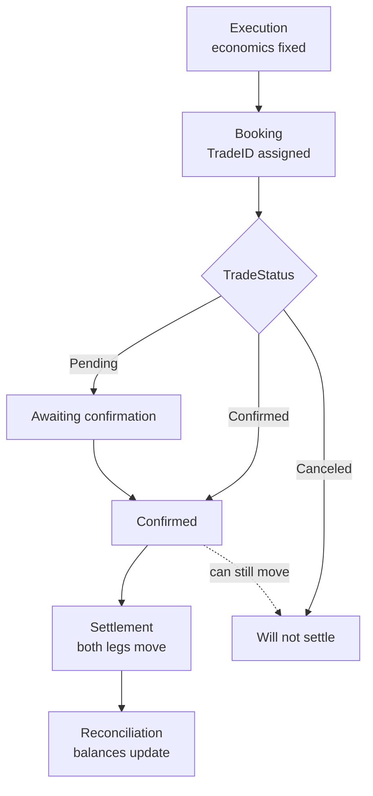

## Stages

<Warning>
Note the dashed edge. A trade can move to `Canceled` **after** appearing as
`Confirmed`. Any system that records the first message it sees as final will
carry cancelled trades on its books indefinitely — key on `TradeID` and always
apply the latest status.
</Warning>

<Steps>
  <Step title="Execution">
    The trade is struck — on acceptance of a quote, or when an order fills.
    Economics are fixed at this point.
  </Step>
  <Step title="Booking">
    The trade is recorded against your account with a unique trade ID and appears
    in your blotter and on the
    [`Trade`](/trading-api/websocket/streams/trade) stream — **regardless of how
    it was executed.** A voice trade and an API order land in the same ledger,
    with the same identifiers. See
    [One ledger](/guides/trading/execution-channels#one-ledger-updated-in-real-time).
  </Step>
  <Step title="Confirmation">
    A trade confirmation is issued, stating the instrument, side, quantity,
    price, fees, net settlement amount, value date, and facing entity.
  </Step>
  <Step title="Settlement">
    Both legs move against your registered settlement instructions. See
    [Settlement](/guides/settlement/overview).
  </Step>
  <Step title="Reconciliation">
    Balances update as each leg completes.
  </Step>
</Steps>

## Trade status

`TradeStatus` on the [`Trade`](/trading-api/websocket/streams/trade) record:

| Status | Meaning |
| --- | --- |
| `Pending` | Booked, not yet confirmed |
| `Confirmed` | Confirmed and proceeding to settlement |
| `Canceled` | Cancelled — will not settle |

<Warning>
A trade can move to `Canceled` after appearing as `Pending` or even `Confirmed`.
Any system that records the first message it sees as final will carry cancelled
trades on its books indefinitely. Key on `TradeID` and always apply the latest
status.
</Warning>

## Reading a confirmation

| Field | Meaning |
| --- | --- |
| Trade ID | Unique reference — quote this in any query |
| Entity | The Trillion Digital entity facing you |
| Instrument | The security traded |
| Side | Buy or sell **from your perspective** |
| Quantity | Amount traded, with its currency |
| Price | Executed price |
| Fee | Fee charged, with its currency |
| Net amount | What actually settles |
| Value date | When settlement is due |

<Warning>
Side is stated from **your** perspective. If you are reconciling against a system
that records the dealer's side, the two will look inverted. Confirm which
convention a downstream system expects before wiring a feed into it.
</Warning>

## Checking a discrepancy

<Steps>
  <Step title="Find the trade ID">
    Everything is keyed on it.
  </Step>
  <Step title="Compare against the platform record">
    The blotter, or the [`Trade`](/trading-api/websocket/streams/trade) stream
    subscribed with a `StartDate`.
  </Step>
  <Step title="Check the status">
    Confirm the trade has not been cancelled or amended since you recorded it.
  </Step>
  <Step title="Raise it">
    Contact your account manager or
    [support@trilliondigital.io](mailto:support@trilliondigital.io) with the
    trade ID. Raise settlement discrepancies **before** the value date — they are
    considerably easier to correct before funds move.
  </Step>
</Steps>
