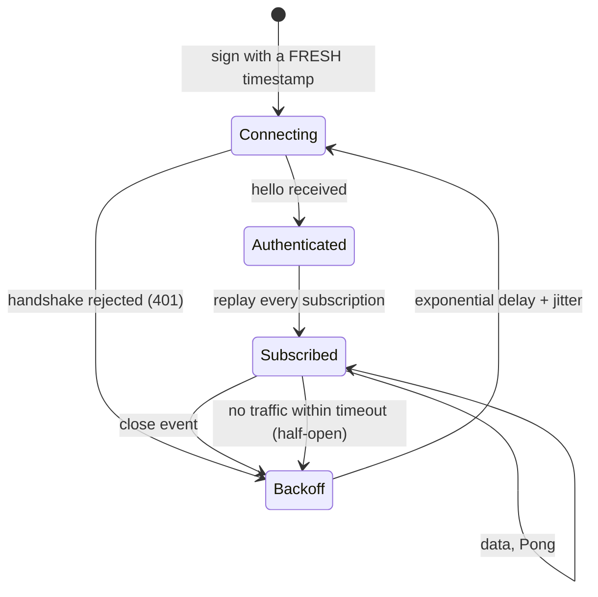

The WebSocket connection is long-lived. Everything except the initial HTTP
handshake — subscriptions, order entry, transfers — happens as JSON messages over
that one socket.



<Note>
Two transitions do the work that naive clients miss: **re-signing on every
attempt** (a cached signature is already expired) and the **half-open path**,
where no close event ever fires and only your own timeout detects the dead
socket.
</Note>

## Connecting

Open a WebSocket to `/ws/v1` with the three authentication headers from
[Authentication](/trading-api/authentication). On success the server sends an
unsolicited `hello` message.

```json Server → client
{
  "type": "hello",
  "ts": "2019-10-16T10:41:23.168807Z",
  "session_id": "1109RQ13KXR00"
}
```

<ResponseField name="type" type="string" required>
  Always `"hello"`.
</ResponseField>

<ResponseField name="ts" type="datetime" required>
  Server time when the session was established.
</ResponseField>

<ResponseField name="session_id" type="string" required>
  Uniquely identifies this WebSocket session. Log it — it is the fastest way for
  support to locate your connection.
</ResponseField>

<Tip>
Treat `hello` as the signal that the socket is ready. Sending subscriptions
before it arrives is a race.
</Tip>

## Request correlation

Every client request carries a `reqid`, and the server echoes it on all responses
to that request. This is how you route responses in a multiplexed connection.

```json Client → server
{
  "reqid": 1,
  "type": "subscribe",
  "streams": [{ "name": "MessageType", "Arg1": 1 }],
  "ts": "2019-02-13T05:17:32.000000Z"
}
```

<ParamField body="reqid" type="number" required>
  Identifies this request. Echoed on every response. **Cannot be `0`.**
</ParamField>

<ParamField body="type" type="string" required>
  The message type — `subscribe`, `cancel`, `ping`, or a command name.
</ParamField>

<ParamField body="ts" type="datetime">
  Optional but recommended. Supplying it lets the platform monitor client-server
  latency and enables certain security features.
</ParamField>

## Response envelope

Every data message shares one envelope.

```json Server → client
{
  "reqid": 1,
  "seq": 1,
  "type": "MessageType",
  "action": "Update",
  "data": [{ "Key": "Value" }],
  "ts": "2019-02-13T05:17:32.000000Z"
}
```

<ResponseField name="reqid" type="number" required>
  Relates this response to your request.
</ResponseField>

<ResponseField name="seq" type="number" required>
  Sequence number **per reqid**. Begins at 1 on the first message for that
  `reqid` and increments by one per message.
</ResponseField>

<ResponseField name="type" type="string" required>
  The message type.
</ResponseField>

<ResponseField name="ts" type="datetime" required>
  Server timestamp.
</ResponseField>

<ResponseField name="data" type="object[]" required>
  The payload. Always an array, even for a single entity.
</ResponseField>

<ResponseField name="initial" type="boolean">
  Set when this message carries the initial snapshot for a request. If a request
  produces responses of several types, more than one message may carry `initial`
  — one per type.
</ResponseField>

<ResponseField name="action" type="string">
  `"Update"` or `"Remove"`. Tells you whether to add/update the entity or drop it
  from your local state. The identifying key depends on the message type.
</ResponseField>

<ResponseField name="tag" type="string">
  Echoed from the stream request, if you supplied one.
</ResponseField>

<ResponseField name="total_count" type="number">
  Total records available for this stream.
</ResponseField>

<Note>
`seq` is for debugging only — **the client is not required to sequence or
gap-detect on it.** Do not build recovery logic that stalls on a perceived gap.
</Note>

## Applying updates correctly

The `action` field makes each stream a materialised view rather than an event
log. The correct client pattern is:

<Steps>
  <Step title="Buffer the initial snapshot">
    Collect messages until you have processed those flagged `initial`.
  </Step>
  <Step title="Upsert on Update">
    Key the entity by its type-specific identifier (`OrderID` for orders,
    `Symbol` for securities, and so on) and replace your local copy.
  </Step>
  <Step title="Delete on Remove">
    Drop the entity from local state. A `Remove` is not an error.
  </Step>
</Steps>

## Heartbeats

The client may send a ping at any time to verify liveness.

```json Client → server
{
  "reqid": 42,
  "type": "ping",
  "ts": "2019-02-13T05:17:32.000000Z"
}
```

<Warning>
A TCP connection can half-open — the socket looks alive locally while no data
flows and no close event ever fires, so automatic reconnect logic never
triggers. Send a periodic ping and treat a missing response within a bounded
window as a dead connection: tear the socket down and reconnect rather than
waiting for an event that will not come.
</Warning>

## Reconnecting

Subscriptions do not survive a disconnect. On reconnect you must:

<Steps>
  <Step title="Generate a fresh timestamp and signature">
    The old signature is expired. Never cache the `ApiSign` header.
  </Step>
  <Step title="Wait for hello">
    Confirm the new session before resubscribing.
  </Step>
  <Step title="Resubscribe to every stream">
    Replay your subscription set. Keep it in memory keyed by stream name so this
    is mechanical.
  </Step>
  <Step title="Reconcile state">
    Each stream resends its initial snapshot. Treat that snapshot as the truth
    and discard local state that does not reappear.
  </Step>
</Steps>

<Tip>
Back off exponentially between reconnect attempts and add jitter. A fleet of
clients reconnecting in lockstep after a brief network blip is far more
disruptive than the blip.
</Tip>
