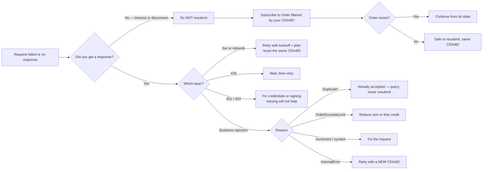

Failures arrive in three distinct layers. Handling only one of them is the most
common gap in a new integration.

## 1. Transport and authentication

REST requests return standard HTTP status codes. A WebSocket handshake that fails
authentication is rejected before the socket opens.

| Status | Meaning | Usual cause |
| --- | --- | --- |
| `401` | Unauthorized | Signature invalid or expired |
| `403` | Forbidden | Key lacks permission for this resource |
| `404` | Not found | Wrong path or unknown identifier |
| `429` | Too many requests | Rate limited |
| `5xx` | Server error | Retry with backoff |

<Warning>
A `401` on a request that worked a moment ago is almost always the timestamp, not
the key. Signatures are timestamp-bound: a clock more than a small drift from UTC
produces valid-looking signatures that never verify. Sync against NTP before
suspecting your credentials.
</Warning>

## 2. Protocol errors

A malformed or invalid WebSocket request produces an error message correlated to
your `reqid`.

```json
{
  "reqid": 12,
  "type": "error",
  "ts": "2021-09-15T04:06:28.530000Z",
  "data": [{ "Text": "..." }]
}
```

Always route on `reqid`. Because the connection is multiplexed, an error is
meaningless unless you can attribute it to the request that caused it.

## 3. Business rejections

The important category, and the one most often missed: **the command succeeded as
a message but the action was refused.** These do not arrive as errors — they
arrive on the subscription as a normal update with a rejection reason.

<CardGroup cols={3}>
  <Card title="Orders" icon="ban">
    `ExecutionReport` with `ExecType: "Rejected"` and an `OrdRejReason`.
  </Card>
  <Card title="Cancels & amends" icon="rotate-left">
    `ExecType: "CancelRejected"` or `"ReplaceRejected"` with a `CxlRejReason`.
  </Card>
  <Card title="Quotes" icon="tag">
    `Quote` with `QuoteStatus: "Rejected"` and a `QuoteRequestRejectReason`.
  </Card>
</CardGroup>

### Order reject reasons

`OrdRejReason` is present when `ExecType` is `Rejected`.

| Reason | What it means |
| --- | --- |
| `UnknownSymbol` | Symbol not recognised or not enabled for your account |
| `OrderExceedsLimit` | Would breach your credit limit — check [Exposure](/trading-api/websocket/streams/credit) |
| `TooLateToEnter` | Market closed or security disabled |
| `UnknownOrder` | Referenced order does not exist |
| `DuplicateOrder` | `ClOrdID` already used |
| `StaleRequest` | Request timestamp too old |
| `InternalError` | Platform-side failure — safe to retry with a new `ClOrdID` |
| `BrokerOption` | Rejected by the liquidity provider |
| `RateLimit` | Too many requests |
| `ForceCancel` | Cancelled by the platform |
| `ImmediateOrderDidNotCross` | IOC order found no matching liquidity |
| `PostOnlyOrderWouldCross` | Post-only order would have taken liquidity |
| `InvalidStrategy` | Unknown or unsupported strategy |
| `QuoteRequestTimeout` | RFQ timed out before the order arrived |
| `QuoteExpired` | Quote expired before the order arrived |

### Cancel and replace reject reasons

`CxlRejReason` is present when `ExecType` is `CancelRejected` or
`ReplaceRejected`.

| Reason | What it means |
| --- | --- |
| `UnknownOrder` | Order not found |
| `Broker` | Refused by the liquidity provider |
| `OrderAlreadyInPendingCancelOrPendingReplaceStatus` | A cancel or replace is already in flight |
| `DuplicateClOrdID` | `ClOrdID` already used |
| `TooLateToCancel` | Order already terminal |
| `StaleRequest` | Request timestamp too old |
| `RateLimit` | Too many requests |
| `InvalidStrategy` | Strategy does not support this operation |
| `Other` | See `Text` |

<Note>
`DuplicateOrder` and `DuplicateClOrdID` are not failures to retry — they mean the
platform already has your request. Retrying with the same `ClOrdID` will keep
failing; retrying with a *new* one risks duplicating a live order. Query the
order's state first.
</Note>

## Should you retry?



<Warning>
The left branch is the expensive one. A disconnect between sending
`NewOrderSingle` and receiving its `ExecutionReport` leaves the outcome
**unknown** — the order may well have been accepted. Resubmitting can double your
position. Always reconcile before retrying an order.
</Warning>

## Retry guidance

<Steps>
  <Step title="Retry transport failures">
    `5xx` and network errors are safe to retry with exponential backoff and
    jitter. Reuse the same `ClOrdID` so the platform can deduplicate.
  </Step>
  <Step title="Never blind-retry rejections">
    A business rejection is a decision, not a glitch. `OrderExceedsLimit` will
    fail identically until exposure changes.
  </Step>
  <Step title="Resolve ambiguity by querying">
    If you did not see a result — timeout, disconnect mid-flight — do not
    resubmit. Subscribe to `Order` filtered by your `ClOrdID` and find out what
    actually happened.
  </Step>
</Steps>

<Warning>
The dangerous case is a disconnect between sending `NewOrderSingle` and receiving
its `ExecutionReport`. The order may well have been accepted. Resubmitting can
double your position. Always reconcile before retrying an order.
</Warning>
