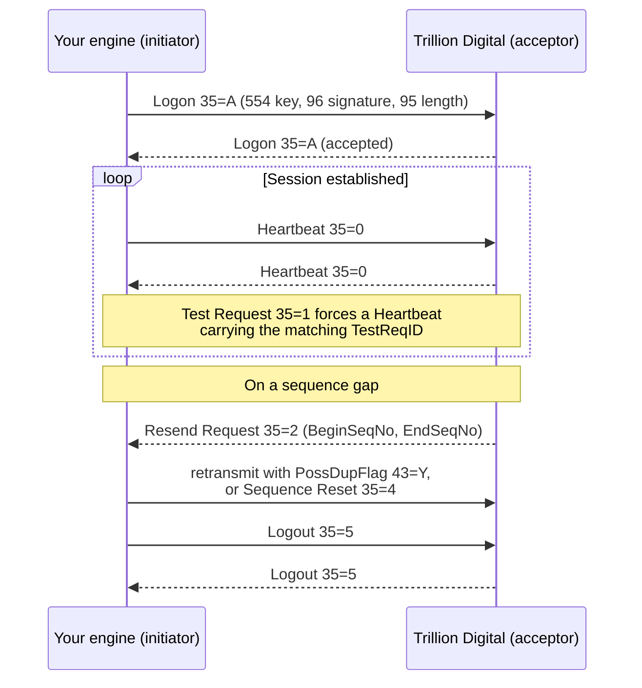

Session level messages open, maintain, recover, and close a FIX 4.4 session.
Every one of them carries the standard header and trailer, shown in the tables
below as the `<MessageHeader>` and `<MessageTrailer>` rows.

Examples on this page use `^A` for the ASCII 01 (SOH) field delimiter.



<Warning>
Logout is not neutral. Orders submitted on this session are cancelled on
disconnect unless each one carried `CancelOnDisconnect` (20030) = `N` — see
[Cancel on Disconnect](/trading-api/fix/overview#cancel-on-disconnect).
</Warning>

## Logon (35=A)

FIX sessions authenticate once, at logon. The signature travels in the Logon
message itself, so there is no per-message signing thereafter.

| Tag | Field | Req | Description |
| --- | --- | --- | --- |
| — | `<MessageHeader>` | Y | `MsgType <35> = A` |
| `108` | HeartBtInt | Y | Note same value used by both sides |
| `141` | ResetSeqNumFlag | N | Indicates both sides of a FIX session should reset sequence numbers |
| `96` | RawData | Y | Contains signature (see below for creating a signature) |
| `554` | Password | Y | Contains the API Key for the Customer user |
| — | `<MessageTrailer>` | Y | |

<Note>
`RawDataLength` (95) is not listed in the specification's Logon table, but the
reference implementation sets it and the example Logon below carries `95=44`.
The value is the character length of the base64 signature string, not the length
of the raw HMAC digest.
</Note>

### Example

```
8=FIX.4.4^A9=143^A35=A^A34=1^A49=CUSTOMER^A52=20220915-18:29:58.756^A56=Trillion Digital^A95=44^A96=ZduZiNxyxS7_4UPDesOryd9KVEecg9LAqqTRR79Pp20=^A98=0^A108=300000^A141=Y^A554=Daniel^A10=248^A
```

The Logon Response carries the same `HeartBtInt` and `ResetSeqNumFlag`, with
`SenderCompID` and `TargetCompID` reversed:

```
8=FIX.4.4^A9=78^A35=A^A34=1^A49=Trillion Digital^A52=20220915-18:29:58.765^A56=CUSTOMER^A98=0^A108=300000^A141=Y^A10=255^A
```

Note that the signature in the example is 44 characters, `_` appears in place of
`/`, and the trailing `=` padding is retained — all consequences of the URL-safe
base64 encoding described below.

## Creating a signature

The signature is created by concatenating

- `SendingTime` (52) as a string
- ASCII 01 value
- `SeqNum` (34) as a string
- ASCII 01 value
- `SenderCompID` (49)
- ASCII 01 value
- `TargetCompID` (56)

This string is then signed using the HMAC SHA-256 Algorithm and the API Secret
for the API Key.

Written out, with `^A` standing for the ASCII 01 byte:

```
{SendingTime}^A{MsgSeqNum}^A{SenderCompID}^A{TargetCompID}
```

Taking the field values from the example Logon above, the string to sign is:

```
20220915-18:29:58.756^A1^ACUSTOMER^ATrillion Digital
```

There are three separators for four values. Nothing precedes `SendingTime` and
nothing follows `TargetCompID`.

<Warning>
**The ASCII 01 value is a byte, not a notation.** It is the SOH control
character `0x01` — the same byte that delimits FIX fields on the wire. Writing
the six literal characters `\u0001`, or a `|`, or `^A`, into the string produces
a signature that is perfectly well formed and simply wrong. The session is
refused at logon with nothing to distinguish it from a bad secret or a wrong API
key, so verify the byte before suspecting the credentials: the signed string for
the example above is 49 bytes, and each separator must be exactly one of them.
</Warning>

<Warning>
**`SendingTime` must be byte-identical in the signed string and in tag 52 of the
transmitted message.** Most FIX engines stamp `SendingTime` themselves as the
message goes out, which means a signing hook that generates its own timestamp
will sign a value the peer never receives. Read tag 52 back off the outgoing
message — as the reference implementation does with
`message.getString(SendingTime.FIELD)` — rather than calling the clock a second
time.

The same applies to precision. The API accepts second, millisecond, and
microsecond timestamps, so `20220915-18:29:58`, `20220915-18:29:58.756`, and
`20220915-18:29:58.756441` are all valid tag 52 values, but they are three
different strings and produce three different signatures. Reformatting,
truncating, or zero-padding the fraction between signing and sending breaks the
signature while leaving the message valid.
</Warning>

### Reference implementation

Sample Java code showing how this can be done programmatically. Note this sample
relies on Apache Commons-Codec and QuickFIX for Java.

```java QuickFIX/J
/**
 * Takes a Message, an apiKey and apiSecret and uses the HMAC-SHA256 algorithm to
 * sign a FIX message by appending the sending-time, sequenceNumber, SenderCompID
 * and TargetCompID with \u0001 separator and signing using the secret, putting it
 * into the RawBytes in Base64 encoding.
 */
private static void signLogon(
        final Message message,
        final SessionID sessionId,
        final String apiKey,
        final String apiSecret) throws FieldNotFound {

    final var senderCompId = sessionId.getSenderCompID();
    final var targetCompId = sessionId.getTargetCompID();
    final var sendingTime = message.getString(SendingTime.FIELD);
    final var seqNum = message.getInt(MsgSeqNum.FIELD);
    final var sep = "\u0001";

    final var hmac = sign(
        apiSecret, sendingTime + sep + seqNum + sep + senderCompId + sep + targetCompId);

    message.setString(Password.FIELD, apiKey);
    message.setInt(RawDataLength.FIELD, hmac.length());
    message.setString(RawData.FIELD, hmac);
}

private static String sign(final String apiSecret, final String data) {
    final var mac = HmacUtils.getInitializedMac(
        HmacAlgorithms.HMAC_SHA_256, apiSecret.getBytes());
    final var encodedBytes = mac.doFinal(data.getBytes());
    final var encoder = Base64.getUrlEncoder(); // URL Safe Base64
    return encoder.encodeToString(encodedBytes);
}
```

<Tip>
In Java source, `"\u0001"` is a compiler-level escape and yields the single SOH
character, so the sample is correct as written. Use whichever escape your own
language resolves to that byte — `"\x01"` in Python, `"\u0001"` in JavaScript,
`\001` in a shell `printf` format — and never a literal backslash sequence in a
context that does not process escapes at all.
</Tip>

<Note>
`Base64.getUrlEncoder()` retains padding. Substitute `+`→`-` and `/`→`_` if you
are building the encoding by hand, but do not strip trailing `=`. This matches
the [REST and WebSocket](/trading-api/authentication) encoding; the string being
signed does not — that construction joins a different set of values with
newlines. The two signatures are not interchangeable.
</Note>

## Heartbeat (35=0)

| Tag | Field | Req | Description |
| --- | --- | --- | --- |
| — | `<MessageHeader>` | Y | `MsgType <35> = 0` |
| `112` | TestReqID | Y | Required when the heartbeat is the result of a Test Request message |
| — | `<MessageTrailer>` | Y | |

`HeartBtInt` (108) is agreed at logon and, per the Logon table, the same value is
used by both sides.

## Test Request (35=1)

| Tag | Field | Req | Description |
| --- | --- | --- | --- |
| — | `<MessageHeader>` | Y | `MsgType <35> = 1` |
| `112` | TestReqID | Y | |
| — | `<MessageTrailer>` | Y | |

The peer answers with a Heartbeat echoing the same `TestReqID`, which is what
makes the reply attributable to a specific probe rather than to the ordinary
heartbeat cadence.

## Resend Request (35=2)

| Tag | Field | Req | Description |
| --- | --- | --- | --- |
| — | `<MessageHeader>` | Y | `MsgType <35> = 2` |
| `7` | BeginSeqNo | Y | |
| `16` | EndSeqNo | Y | |
| — | `<MessageTrailer>` | Y | |

Retransmitted messages carry `PossDupFlag` (43) — always required for
retransmitted messages, whether prompted by the sending system or as the result
of a resend request — and `OrigSendingTime` (122), required for a message re-sent
as a result of a Resend Request. If the original sending time is not available,
`OrigSendingTime` is set to the same value as `SendingTime` (52).

<Note>
Sessions can be configured with or without FIX session level message recovery. A
typical setup uses two sessions: one for market data with recovery disabled, and
one for order submission with recovery enabled. Resend behaviour therefore
differs between your two sessions, and a market data session will not replay a
gap for you.
</Note>

## Reject (35=3)

Session level reject. Business level rejections arrive as an
[ExecutionReport or OrderCancelReject](/trading-api/fix/orders) instead.

| Tag | Field | Req | Description |
| --- | --- | --- | --- |
| — | `<MessageHeader>` | Y | `MsgType <35> = 3` |
| `45` | RefSeqNum | Y | `MsgSeqNum` of rejected message |
| `371` | RefTagID | N | The tag number of the FIX field being referenced |
| `372` | RefMsgType | N | The `MsgType` of the FIX message being referenced |
| `373` | SessionRejectReason | N | Code to identify reason for a session-level Reject message |
| `58` | Text | N | Where possible, message to explain reason for rejection |
| — | `<MessageTrailer>` | Y | |

Log `RefSeqNum`, `RefTagID`, and `Text` together. `RefTagID` names the offending
field and is often the only indication of which part of the message the session
objected to. Only `RefSeqNum` is required, so a Reject may arrive carrying
nothing else — correlate it against your own outbound sequence numbers.

## Sequence Reset (35=4)

| Tag | Field | Req | Description |
| --- | --- | --- | --- |
| — | `<MessageHeader>` | Y | `MsgType <35> = 4` |
| `123` | GapFillFlag | N | |
| `36` | NewSeqNo | Y | |
| — | `<MessageTrailer>` | Y | |

## Logout (35=5)

| Tag | Field | Req | Description |
| --- | --- | --- | --- |
| — | `<MessageHeader>` | Y | `MsgType <35> = 5` |
| `58` | Text | N | |
| — | `<MessageTrailer>` | Y | |

<Warning>
By default, all open orders submitted via the FIX session are cancelled on
disconnect — a clean Logout and a dropped TCP connection have the same effect on
your working orders, and reconnecting does not restore them.

Cancel on Disconnect does not affect other orders for the same user that were
submitted on other sessions, or orders that were explicitly placed with
`CancelOnDisconnect` (20030) set to `N`. If an order must outlive the session,
submit it that way in the first place — see
[NewOrderSingle](/trading-api/fix/orders).
</Warning>
