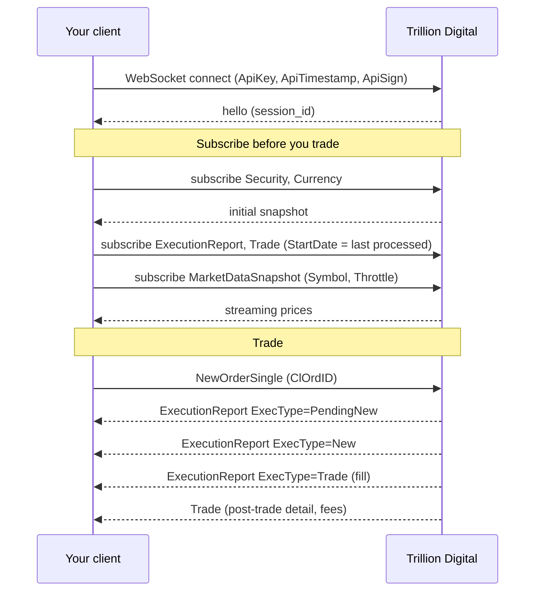

The WebSocket API is where most of the Trading API lives. One authenticated
connection carries every subscription and every command.

```
wss://sandbox.trading.trilliondigital.io/ws/v1     # sandbox
wss://trading.trilliondigital.io/ws/v1             # production
```

## Two kinds of message

<CardGroup cols={2}>
  <Card title="Subscriptions" icon="signal" href="/trading-api/websocket/subscriptions">
    Open a continuous stream of data — prices, orders, trades, balances. You
    receive an initial snapshot followed by incremental updates.
  </Card>
  <Card title="Commands" icon="paper-plane" href="/trading-api/websocket/commands">
    Perform an action — submit an order, request a quote, initiate a withdrawal.
    Results arrive on the corresponding subscription, not as a direct reply.
  </Card>
</CardGroup>

<Warning>
This is the most common source of confusion for new integrations. A command such
as `NewOrderSingle` does **not** return the resulting order in its response. It
returns an acknowledgement or an error. The order itself appears on the
[Order](/trading-api/websocket/streams/order) and
[ExecutionReport](/trading-api/websocket/streams/order) streams.

**Subscribe before you send commands**, or you will miss the result of your own
action.
</Warning>

## Available streams

| Stream | Purpose |
| --- | --- |
| [`Security`](/trading-api/websocket/streams/security) | Securities available to trade |
| [`Currency`](/trading-api/websocket/streams/currency) | Currencies and their increments |
| [`MarketDataSnapshot`](/trading-api/websocket/streams/market-data-snapshot) | Live bid/offer levels |
| [`CurrencyConversion`](/trading-api/websocket/streams/currency) | Conversion rates between currencies |
| [`Quote`](/trading-api/websocket/streams/quote) | RFQ quote lifecycle |
| [`Order`](/trading-api/websocket/streams/order) | Order state |
| [`ExecutionReport`](/trading-api/websocket/streams/order) | Order events and fills |
| [`Trade`](/trading-api/websocket/streams/trade) | Post-trade detail |
| [`Balance`](/trading-api/websocket/streams/balance) | Balance updates |
| [`BalanceTransaction`](/trading-api/websocket/streams/balance) | Deposits, withdrawals, adjustments |
| [`Exposure`](/trading-api/websocket/streams/credit) | Credit utilisation |

## Available commands

| Command | Purpose |
| --- | --- |
| `NewOrderSingle` | Submit an order |
| `OrderCancelRequest` | Cancel an order |
| `OrderCancelReplaceRequest` | Amend an order |
| `OrderControlRequest` | Pause, resume, or control a working order |
| `QuoteRequest` | Request a quote (RFQ) |
| `QuoteCancelRequest` | Cancel a quote request |
| `NewWithdrawRequest` | Request a withdrawal |
| `WithdrawCancelRequest` | Cancel a withdrawal |
| `NewDepositRequest` | Notify an incoming deposit |

See [Commands](/trading-api/websocket/commands) for payloads.

## A typical session



## The order workflow

This is the sequence the platform documentation prescribes. Steps 2 and 3 are
the recovery mechanism — they are what makes a restart safe.

<Steps>
  <Step title="Subscribe to MarketDataSnapshot">
    For the securities you intend to trade.
  </Step>
  <Step title="Subscribe to ExecutionReport with StartDate">
    Set `StartDate` to the `Timestamp` of the **last ExecutionReport you
    processed**, to recover order state across a restart.
  </Step>
  <Step title="Subscribe to Trade with StartDate">
    Same technique, to recover any trades missed while you were disconnected.
  </Step>
  <Step title="Maintain a map of open orders">
    Keyed by `OrderID`, holding the last `ExecutionReport` received for it.
  </Step>
  <Step title="Maintain a set of pending ClOrdIDs">
    One entry per in-flight request, so you can correlate the response.
  </Step>
  <Step title="Submit">
    Generate a fresh `ClOrdID` and send
    [`NewOrderSingle`](/trading-api/websocket/commands#neworldersingle).
  </Step>
  <Step title="Correlate the response">
    It arrives on `ExecutionReport` carrying your `ClOrdID`. `ExecType=PendingNew`
    means accepted — add it to your open-order map.
  </Step>
  <Step title="Amend or cancel">
    Generate a **new** `ClOrdID` and send `OrderCancelRequest` or
    `OrderCancelReplaceRequest`, referencing `OrigClOrdID` from the previous
    successful request.
  </Step>
  <Step title="Consume fills">
    Fills arrive as `ExecutionReport` with `ExecType=Trade`.
  </Step>
</Steps>

<Warning>
`ClOrdID` must be unique **daily** and across any open order, and the
specification states it must be under 36 characters. Note that the platform's
own examples use 36-character hyphenated UUID4s, so the boundary is ambiguous —
a UUID4 with hyphens stripped (32 characters) is unambiguously safe.
</Warning>

<Note>
The order API broadly follows FIX semantics, with differences documented in the
[order state matrices](/trading-api/fix/state-matrices).
</Note>
