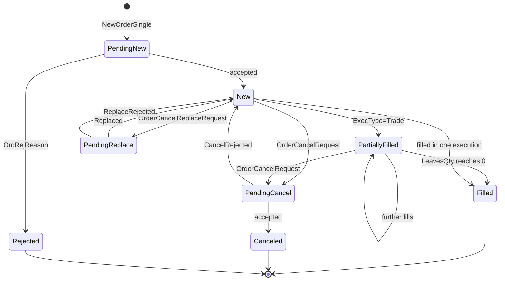

Two streams cover the order lifecycle. `Order` carries current order state;
`ExecutionReport` carries each event that changed it. Their payloads share a
structure — subscribe to both.

<Note>
`ExecType` describes the **specific event** (for example `PendingCancel`), while
`OrdStatus` always reflects the **current state** of the order (for example
`PartiallyFilled`). Read `OrdStatus` to know where the order stands; read
`ExecType` to know what just happened.
</Note>

## Order state

Drive your state machine from `OrdStatus`.



<Warning>
An order in `PendingCancel` is **still live and still fillable**. The cancel is a
request, not an instruction — until `ExecType=Canceled` arrives, the order can
trade. Treating `PendingCancel` as terminal and releasing the hedge is a
recognised way to end up unintentionally long or short.
</Warning>

## Subscribe

```json
{
  "reqid": 7,
  "type": "subscribe",
  "streams": [{ "name": "ExecutionReport" }]
}
```

### Parameters

Both streams accept the same filters.

<ParamField body="StartDate" type="string">
  Return orders submitted after this time.
</ParamField>
<ParamField body="EndDate" type="string">
  Return orders submitted before this time.
</ParamField>
<ParamField body="Symbol" type="string">Filter by security.</ParamField>
<ParamField body="Statuses" type="string[]">
  Filter by order status, for example `New,Filled`.
</ParamField>
<ParamField body="OrderID" type="string">Filter by order ID.</ParamField>
<ParamField body="RFQID" type="string">Filter by RFQ ID.</ParamField>

## Response

### Identity

<ResponseField name="Timestamp" type="datetime" required>Timestamp of the message.</ResponseField>
<ResponseField name="OrderID" type="string" required>Server-assigned order ID (UUID).</ResponseField>
<ResponseField name="ClOrdID" type="string" required>Client-assigned ID for the last request.</ResponseField>
<ResponseField name="OrigClOrdID" type="string" required>Original client-assigned ID.</ResponseField>
<ResponseField name="ExecID" type="string" required>Server-assigned ID of this update (UUID).</ResponseField>
<ResponseField name="Symbol" type="string" required>Symbol of the order's security.</ResponseField>
<ResponseField name="SubmitTime" type="datetime" required>Time of original submission.</ResponseField>
<ResponseField name="SessionID" type="string" required>Session that submitted this order.</ResponseField>
<ResponseField name="CancelSessionID" type="string">
  If set, the order is cancelled when that session closes.
</ResponseField>

### State

<ResponseField name="ExecType" type="string" required>
  The specific execution event. One of `New`, `Trade`, `Canceled`, `Replaced`,
  `PendingCancel`, `Stopped`, `Rejected`, `PendingNew`, `Restated`,
  `PendingReplace`, `CancelRejected`, `ReplaceRejected`, `PendingResume`,
  `Resumed`, `PendingPause`, `Paused`, `Triggered`, `Started`.
</ResponseField>
<ResponseField name="OrdStatus" type="string" required>
  Current order status. One of `New`, `PartiallyFilled`, `Filled`, `Canceled`,
  `PendingCancel`, `Rejected`, `PendingNew`, `PendingReplace`.
</ResponseField>
<ResponseField name="Side" type="string" required>`Buy` or `Sell`.</ResponseField>
<ResponseField name="OrdType" type="string" required>`Market`, `Limit`, or `RFQ`.</ResponseField>
<ResponseField name="TimeInForce" type="string" required>
  `GoodTillCancel`, `FillAndKill`, or `FillOrKill`.
</ResponseField>

### Quantities

<ResponseField name="OrderQty" type="decimal" required>Order quantity.</ResponseField>
<ResponseField name="Currency" type="string" required>Currency the quantity is expressed in.</ResponseField>
<ResponseField name="AmountCurrency" type="string" required>Currency of amount.</ResponseField>
<ResponseField name="LeavesQty" type="decimal" required>
  Quantity still open for execution. Normally `OrderQty − CumQty`; may be `0` when
  the order is `Canceled` or `Rejected`.
</ResponseField>
<ResponseField name="CumQty" type="decimal" required>
  Total quantity filled, always in `Currency` units (BTC on a BTC-USD order).
</ResponseField>
<ResponseField name="CumAmt" type="decimal">
  Total amount filled, always in amount currency (USD on a BTC-USD order).
</ResponseField>
<ResponseField name="AvgPx" type="decimal">
  Average fill price. Valid only when `CumQty > 0`. **Excludes fees.**
</ResponseField>
<ResponseField name="Price" type="decimal">Limit price. Present when `OrdType` is `Limit`.</ResponseField>

### Last fill

Present when `ExecType` is `Trade`.

<ResponseField name="LastPx" type="decimal">Price of the last fill.</ResponseField>
<ResponseField name="LastQty" type="decimal">Quantity of the last fill.</ResponseField>
<ResponseField name="LastAmt" type="decimal">Amount of the last fill.</ResponseField>
<ResponseField name="LastFee" type="decimal">Fee on the last fill.</ResponseField>
<ResponseField name="LastFeeCurency" type="string">
  Currency of the last fee. May differ from the cumulative fee currency.
</ResponseField>
<ResponseField name="FeeCurency" type="string">Cumulative fee currency.</ResponseField>

### Rejections

<ResponseField name="OrdRejReason" type="string">
  Present when `ExecType` is `Rejected`. One of `UnknownSymbol`,
  `OrderExceedsLimit`, `TooLateToEnter`, `UnknownOrder`, `DuplicateOrder`,
  `StaleRequest`, `InternalError`, `BrokerOption`, `RateLimit`, `ForceCancel`,
  `ImmediateOrderDidNotCross`, `PostOnlyOrderWouldCross`, `InvalidStrategy`,
  `QuoteRequestTimeout`, `QuoteExpired`.
</ResponseField>
<ResponseField name="CxlRejReason" type="string">
  Present when `ExecType` is `CancelRejected` or `ReplaceRejected`. One of
  `UnknownOrder`, `Broker`,
  `OrderAlreadyInPendingCancelOrPendingReplaceStatus`, `DuplicateClOrdID`,
  `TooLateToCancel`, `StaleRequest`, `RateLimit`, `InvalidStrategy`, `Other`.
</ResponseField>
<ResponseField name="Text" type="string">Human-readable error message.</ResponseField>

### RFQ linkage

<ResponseField name="QuoteID" type="string">Quote this order traded on.</ResponseField>
<ResponseField name="RFQID" type="string">RFQ this order traded on.</ResponseField>
<ResponseField name="AllowedSlippage" type="decimal">
  Allowed slippage in absolute terms — `0.001` is 10 bps.
</ResponseField>
<ResponseField name="Strategy" type="string">Order strategy in use.</ResponseField>
<ResponseField name="CustomerUser" type="string">Customer user associated with this report.</ResponseField>

<Warning>
`AvgPx` excludes fees. For an all-in economic price use the
[`Trade`](/trading-api/websocket/streams/trade) stream, which carries `Fee` and
`Amount` explicitly. Reconciling P&L from `AvgPx` alone will understate cost.
</Warning>

## Order strategies

`Strategy` selects an execution algorithm. `SteadyPace` and `StopLimit` are
supported, each with their own `Parameters` object. Only `SteadyPace` orders may
be amended via `OrderCancelReplaceRequest`.
