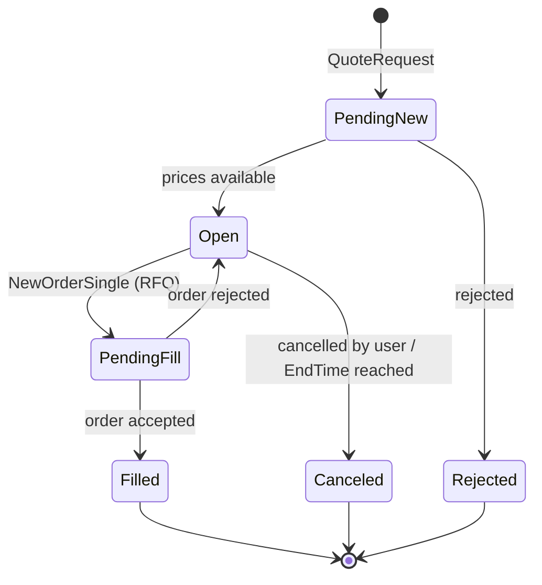

Request-for-quote lets you poll multiple dealers simultaneously and trade on the
best price returned. Quote responses arrive on the `Quote` stream; the resulting
order arrives on `ExecutionReport`.

## Workflow

<Steps>
  <Step title="Subscribe to Quote">
    Open the `Quote` stream before requesting anything.
  </Step>
  <Step title="Subscribe to ExecutionReport">
    Order responses arrive here, not on the `Quote` stream.
  </Step>
  <Step title="Subscribe to Trade">
    Use `StartDate` set to the timestamp of the last trade you processed, to
    recover anything missed while disconnected.
  </Step>
  <Step title="Send a QuoteRequest">
    Generate a unique `QuoteReqID` and send
    [`QuoteRequest`](/trading-api/websocket/commands#quoterequest) with
    `OrderQty`, `Currency`, and `Symbol`.
  </Step>
  <Step title="Receive Quote updates">
    One or many `Quote` messages arrive as streaming prices update.
  </Step>
  <Step title="Accept a quote">
    Send `NewOrderSingle` with `OrdType: "RFQ"` referencing the `RFQID` and
    `QuoteID`.
  </Step>
  <Step title="Confirm the fill">
    Fills arrive as `ExecutionReport` with `ExecType: "Trade"`, and `QuoteStatus`
    moves to `Filled`.
  </Step>
</Steps>

<Warning>
Quotes time out automatically after **3 minutes** by default. `ValidUntilTime` on
each quote is authoritative — check it before accepting rather than assuming the
default.
</Warning>

<Tip>
`QuoteReqID` must be globally unique and **36 characters or fewer**. A UUID4 fits
exactly and is the recommended choice.
</Tip>

## Subscribe

```json
{
  "reqid": 9,
  "type": "subscribe",
  "streams": [{ "name": "Quote" }]
}
```

### Parameters

<ParamField body="StartDate" type="string">Return quotes after this time.</ParamField>
<ParamField body="EndDate" type="string">Return quotes before this time.</ParamField>
<ParamField body="Symbol" type="string">Filter by security.</ParamField>
<ParamField body="RFQID" type="string">Filter by RFQ ID.</ParamField>

## Response

<ResponseField name="Timestamp" type="datetime" required>Timestamp of the message.</ResponseField>
<ResponseField name="Symbol" type="string" required>Symbol of the security.</ResponseField>
<ResponseField name="Currency" type="string" required>Currency of the quantity.</ResponseField>
<ResponseField name="QuoteReqID" type="string" required>Your client-assigned request ID.</ResponseField>
<ResponseField name="QuoteID" type="string" required>Server-assigned ID for this quote update.</ResponseField>
<ResponseField name="RFQID" type="string">Server-assigned RFQ ID.</ResponseField>
<ResponseField name="QuoteStatus" type="string" required>
  One of `PendingNew`, `Open`, `PendingCancel`, `Canceled`, `PendingFill`,
  `Filled`, `Rejected`.
</ResponseField>
<ResponseField name="SubmitTime" type="datetime" required>Time of the original request.</ResponseField>
<ResponseField name="OrderQty" type="decimal" required>Requested quantity.</ResponseField>
<ResponseField name="AmountCurrency" type="string" required>Currency of amount.</ResponseField>
<ResponseField name="Side" type="string" required>`Buy` or `Sell`.</ResponseField>
<ResponseField name="EndTime" type="datetime" required>End time of the RFQ.</ResponseField>
<ResponseField name="ValidUntilTime" type="datetime" required>
  Expiry of this quote. **Check this before accepting.**
</ResponseField>

### Prices

<ResponseField name="BidPx" type="decimal">Bid price.</ResponseField>
<ResponseField name="BidAmt" type="decimal">Bid amount in `AmountCurrency`.</ResponseField>
<ResponseField name="OfferPx" type="decimal">Offer price.</ResponseField>
<ResponseField name="OfferAmt" type="decimal">Offer amount in `AmountCurrency`.</ResponseField>

### If filled

<ResponseField name="TradedPx" type="decimal">
  Trade price. This is an **all-in price that includes fees**.
</ResponseField>
<ResponseField name="TradedQty" type="decimal">Trade quantity in `Currency`.</ResponseField>
<ResponseField name="TradedAmt" type="decimal">Trade amount in `AmountCurrency`.</ResponseField>
<ResponseField name="TradedSide" type="string">Side of the trade.</ResponseField>

### Errors

<ResponseField name="QuoteRequestRejectReason" type="string" required>
  Reject reason. Values include `UnknownSymbol`, `OrderExceedsLimit`,
  `TooLateToEnter`, `UnknownOrder`, `DuplicateOrder`, `StaleRequest`,
  `InternalError`, `BrokerOption`, `RateLimit`, `ForceCancel`,
  `ImmediateOrderDidNotCross`, `PostOnlyOrderWouldCross`, `InvalidStrategy`,
  `QuoteRequestTimeout`, `QuoteExpired`.
</ResponseField>
<ResponseField name="Text" type="string">Human-readable error message.</ResponseField>
<ResponseField name="CustomerUser" type="string">Customer user associated with this quote.</ResponseField>

<Note>
`TradedPx` is all-in and includes fees, whereas `AvgPx` on an
[`ExecutionReport`](/trading-api/websocket/streams/order) does not. When
comparing an RFQ execution against a benchmark, make sure you are comparing like
with like.
</Note>

## Quote status transitions


